## Interpretable Machine Learning

Résumé :  Ce cours est à destination des étudiants du master 2 ECAP de l'IAE Nantes. Il vise à résumer les méthodes d'interpretation de modèle de machine learning qualifié de "Black Box" et ainsi rendre le modèle explicable.

La premiere partie s'attardera sur la notion d'explicabilité et les différents cas où il s'avére néccessaire de rendre la décision d'un modèle de machine learning humainement interpretable.

Après avoir exploré les différents concepts d'interpratibilité nous étudierons brièvement les modèles interprétable par nature ( concept déja maitrîsé dans votre cursus) puis nous recentrerons le cours sur les "models agnostic methods" afin d'interpréter les modèles boites noirs.

Nous verrons pour chaque méthode leur explication théroqie et comment elles sont construires et leur implémentation avec le langage Python.

De plus nous concluerons systématiquement par les avantages et inconvénient de chaque méthode citée.

Le cours est aujourd'hui traiter pour interpréter des données tabulaires ce qui correspond aux données que vous traitez majoritarement dans le cadre de votre formation mais il existe également des méthodes d'interpétation pour **des données non tabulaire!**

### Qu'est ce que le machine learning

Avant d'entammer une définition précise de l'interprétabilité et explicabilité des modèles d'apprentissage automatique. il convient de bien définir l'apprentissage automatique ou Machine Learning.

Parfois, il est confondu avec la notion d'algorithme.

Illustration d'un algorithme VS Machine Learning

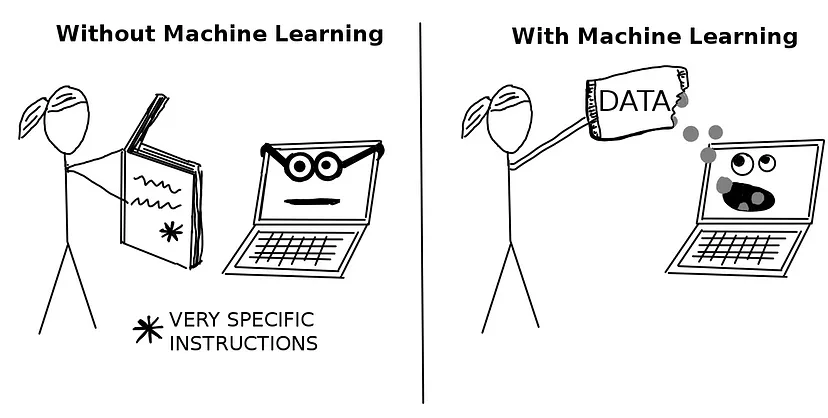

**Un algorithme** : Est un ensemble de règle définie par un humain qui sont éxécutées par une machine afin d'atteindre un but prédéfénis.

On peut le voir comme un processus qui définit des intputs et prévoit tous les étapes permettant de transformer nos inputs en output désirés.

```python
def celsius_to_fahrenheit(celsius):
    """
    Convertit une température de degrés Celsius en Fahrenheit.
    Inputs:
        - celsius (float): température en degrés Celsius
    Output:
        - float: température en Fahrenheit
    """
    # Étape 1 : Appliquer la formule de conversion
    fahrenheit = (celsius * 9/5) + 32

    # Étape 2 : Retourner le résultat
    return fahrenheit

# Exemple d'utilisation
print(celsius_to_fahrenheit(25))  # Output : 77.0

```

L'utilisation d'un algorithme ici est idoine. On connait les instructions qu'on souhaite réaliser et comment transformer nos intput pour obtenir l'output désiré.

**Machine Learning :** C'est une méthode qui permet à un programme d'apprendre à partir de données afin de réaliser et optimiser une prédiction. C'est un changement de paradigm de la *programmation normale* où on définit explicitement nos étapes et nos règles à une *programmation indirecte* où les règles elles-mêmes émanement de la Data.

#### Machine Learning VS Statistical Learning

L'approche statistique(économetrique) s'attarque à comprendre le processus générateur d'un phénomène Y en se basant sur les co-informations X.

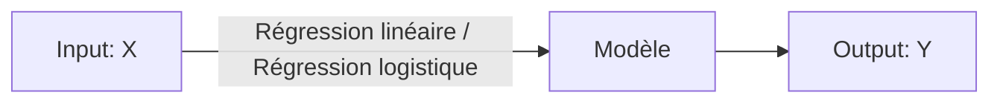

Le machine learning quant à lui cherche à approximer Y à l'aide d'une fonction f(x) sans s'attarder sur les relations entre Y et f(x).

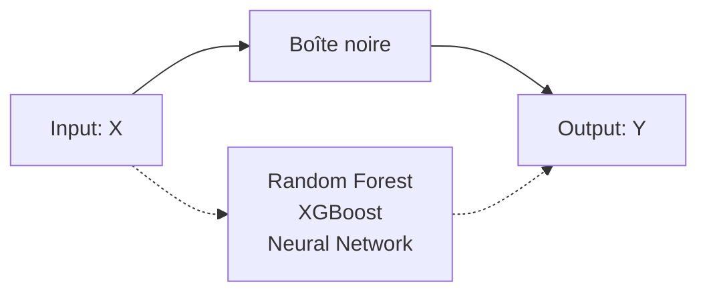

Avec un modèle de machine complexe nous sommes en incapactié d'explicité le résultat pour une prédiction individuelle.

Pourquoi dois-je refuser un prêt pour ce client? La seul réponse que je je peux apporter est "parce-que le modèle me le dit"

### De l'importance de l'interpretability :

Il n'existe pas de définition mathématique formelle de l'interprétabilité mais nous pouvons repondre la définition données par Miller(2017):

> L'interpretabilité d'un modèle de Machine Learning est la capacité d'un humain à comprendre les causes d'une décision du modèle.

Plus un interprétabilité du modèle sera forte plus un humain sera en mesure de comprendre les décisions/critères influencant la prédiction du modèle.

Dans ce cours nous distinguerons également une nuance entre Interpretabilité d'un modèle et Explicabilité.

**💡Explicabilité** : Explication de prédiction individuelle

**📖 Interprétabilité** : Compréhension générale du modèle et comment sont réalisées les prédictions

#### Compromis entre interprétabilité et pouvoir prédictif

Lors de l'entrainement  d'un modèle d'apprentissage automatique vous aurez systématiquement à choisir entre le "**Pourquoi" et le "Quoi".**

Un modèle permettant de comprendre facilement **"Pourquoi"** je réalise tel ou tel prédiction offre généralement de performance moins bonne, de fait un **"quoi"** plus faible.

---

**Exemple du Customer Churn :**

Un client souhaite partir de votre enseigne et votre modèle de ML détecte avec une probabilité de 98% qu'il va quitter votre enseigne. Cette information est importante car elle priorise de client pour agir tout de suite afin de le retenir.

En revanche, cela ne vous aucune information de comment le retenir

Qu'est ce qui pousse mon client à partir? Cette question n'est pas répondue.

- Le positionnement de mon prix?
- Une insatifaction ?

Ce compromis doit être guidé par l'objectif que vous recherchez.                                                                                                             Généralement le Pourquoi l'importe dans les cas suivants :

- Recherche scientifique afin de comprendre un phénomène ==> Pourquoi
- Quand le problème est déja très bien cadré et déja résolu ==> What Optical charactère recognition
- Authorité régulatrice besoin de comprendre le modèle

```markdown
> [!NOTE]
Suivant la problématique que vous souhaitez résoudre vos aurez à choisir entre maximiser l'interprétabilité de votre modèle ou son pouvoir explicatif.

D'où l'importance de cadrer précisement le problème que vous souhaitez adresser
```

#### Taxonomie des interprétations de modèles

Le premier niveau d'interprétabilité porte sur la **capacité intrinsèque** d'un modèle à être interprétable ou alors être **interprétable post hoc.**

**Capacité intrinsèque :**

On l'obtient en contraignant le modèle en restreignant sa compléxité (nombre de features) afin de le comprendre aisément contre  des méthodes utilisées pour interpréter le modèle post entrainement.

L'interprétabilité intrinsèque se refere à des modèles simle comme (Régression linéaire, Logistique,  Arbre de regression/classification simple, SVM)

**Post hoc:**

L'interpretabilité se refère à des modèles plus complexes qui sont interprétables post-entrainement grace à des méthodes extérieurs aux modèles (Feature importance)

> 💡Le post Hoc interpretabilité peut aussi s'utiliser sur des modèles interpretable intrinsèque

Globalement, il existe 5 méthodes d'interprétation qu'on peut diviser de la façon suivante :

- **Feature summary statistic** : Statistique par feature permettant d'interpréter son rôle dans le modèle (Feature Importante)
- **Feature summary visualization** : Représentation visuels des statistiques en visualisation quand le nombre de statistiques rend difficilie l'interpration une à une (Partial Dependance Plot)
- **Model internal** : Paramètre interne du modèle permettant l'interprétation des résultats ( Poids du modèles Reg liénaire, Structure arbre)
- **Data point** : L'interpréation par individu spécifique du jeu de données, on se concentre sur un invidividu spécifique afin d'expliquer sa prédiction (Counter factual prédiction)
- Intrinsically interpretable model : Approximer un modèle Black Box par un modèle interprétable localement ou Globalement (ref model internal)

> 💡On parle de modèle spécifique quand l'interprétation est propre à un type de modèle et de modèle agnostic quand la méthode s'applique à tout type de modèle.

### Les différents niveaux d'interprétabilités

#### L'interprétabilité Global ou Hoslitique

Un modèle est globalement interprétable si l'on peut comprendre **l'ensemble de son fonctionnement** d'un seul coup d'œil ou avec une vue d'ensemble complète. Il faut être capable de :

* Comment le modèle effectue ses prédictions (les mécanismes internes).
* L'importance des variables/features.
* Les interactions entre les variables.
* La distribution des sorties (cible) en fonction des caractéristiques d'entrée.

Il est très rare de pouvoir atteindre ce niveau de connaissance d'un modèle quand on dépasse 3 Features. Dès lors qu'on dépasse des représentations à 3 dimensions, il est impossible pour un humain de se représenter les intéractions.

#### L'interprétabilité Global à un niveau modulaire

Comprendre un modèle entier, comme un Naive Bayes avec des centaines de variables, est pratiquement impossible. Cela nécessiterait de mémoriser tous les poids et d’évaluer la distribution conjointe des variables, une tâche irréaliste.

Plutôt que de chercher à comprendre tout le modèle, on peut analyser certaines parties spécifiques :

Pour les modèles linéaires on peut interpréter ses poids toutes choses étant égale par ailleurs. Cela signifie que les autres paramètres sont inchangés pour intrépter l'effet d'une variable.

Dans les faits, il est rare qu'une variable varie alors que les autres sont constantes.

#### **Interprétabilité locale pour une prédiction unique**

Comprendre pourquoi un modèle a fait une prédiction particulière pour une instance donnée.

À un niveau local, le comportement d’un modèle complexe peut devenir plus simple. Par exemple :

Une relation non linéaire entre la taille et le prix d’une maison peut se comporter de manière linéaire pour une maison de 100 m² si l’on observe uniquement cette instance.

On peut tester cela en simulant des modifications de la taille (+ ou - 10 m²) et en observant l’impact sur la prédiction.

**Avantage** : Les explications locales sont souvent plus précises que les explications globales, car elles se concentrent sur un sous-ensemble restreint de données.

**Méthodes disponibles** : Les techniques indépendantes des modèles ( **model-agnostic methods** ) permettent de rendre les prédictions individuelles plus interprétables.

**Conclusion** : Approfondir une instance spécifique permet de mieux comprendre les décisions du modèle, même lorsqu’il est complexe au niveau global.

#### Interprétabilité locale pour un groupe de prédictions

Comprendre pourquoi le modèle a fait des prédictions spécifiques pour un groupe d’instances.

**Méthodes disponibles** :

1. **Approches globales** : Appliquer des méthodes d'interprétation globale, mais en considérant le groupe comme s'il s'agissait de l'ensemble complet des données.
2. **Approches locales** : Utiliser des explications locales pour chaque instance individuelle, puis les combiner ou les agréger pour le groupe.

### Qu'est ce qu'une explication humainement compréhensible

Une explication est une réponse à une question formulée avec un "Pourquoi" (Miller 2017)

- Pourquoi mon client va-t-il arréter son contrat?
- Pourquoi mon prêt à été rejetté?

Le fait de donner une bonne explication à été étudiée par Lipton en 1990.

Un humain ne souhaite pas saisir l'ensemble des causes déterminants une prédiction mais plutôt comprendre la prédiction a été réalisée plutôt qu'une autre.

Nous avons tendance à penser à des contres exemples pour comprendre une prédiction.

Combien serait estimée le prix de ma maison si j'augmente le nombre de pièces de 1?

Si je demande un prêt à la banque, je ne cherche pas à comprendre tous les facteurs qui ont entrainé mon rejet mais seulement ceux sur lequel je peux agir!

**Transposé au machine learning : Cela signifie**

Les humains préfèrent les explications contrastives, qui comparent une prédiction à une autre situation hypothétique ou réelle. Ces explications doivent être adaptées au **contexte** et au **destinataire**, en choisissant un point de référence pertinent (par exemple, une maison similaire pour expliquer une prédiction de prix immobilier).

Les explications doivent également être courtes et sélectionnées : les gens attendent 1 à 3 causes principales plutôt qu’une liste exhaustive. Ce phénomène, connu sous le nom **d’effet Rashomon**, illustre qu’un événement peut avoir plusieurs explications valables (chaine d'infos à la TV). Les méthodes comme LIME, qui fournissent des explications simples et compréhensibles, sont bien adaptées à cet objectif.

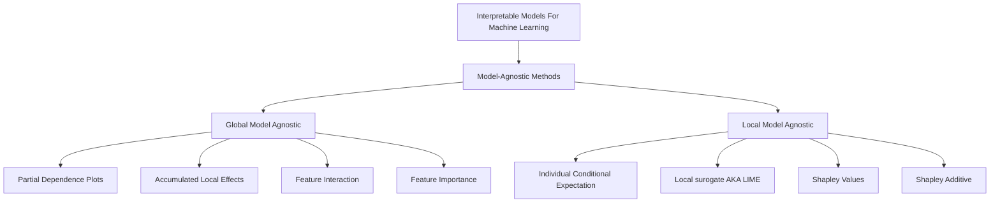

### Modèle Linéaire et interprétation

Réaliser un exemple avec une régression liénaire sur la vente de vélo

### Global Model Agnostic

Les méthodes globales décrivent le comportement **moyen** de votre modèle de Machine Learning. Elles sont particulièrement utiles lorsuq'il s'agit de comprendre les mécanismes généraux de votre modèle et ainsi le validé ou l'invalidé.

Dans ce cours nous étudierons les méthodes suivantes :

- Partial dependance plot :  Effet marginal d'une variable (qualitative ou quantitvative) sur la target
- Accumulated Local Effect : `<remplir>`
- Feature Interaction (H-statistic) : Quantifie les effets joints des variables
- Feature Importance : Mesure l'effet d'une feature sur la fonction de perte

#### Partial Depence plot

##### Théorie

Le partial depence plot ou (PDP) nous montre l'effet marginal d'une ou 2 variables sur la target que nous chercons à prédire. PDP peut donc nous montrer la nature de la relation existante entre une variable du modèle et la target que celle ci soit liénaire ou non linéaire, monotone ou même plus complexe.

$\hat{f}_S(x_S) = \mathbb{E}_{X_C} \left[ \hat{f}(x_S, X_C) \right] $

Avec :

* $x_S$ : les variables pour lesquelles on veut analyser l'effet sur la prédiction.
* $X_C$ : les autres variables participant à votre modèle.
* $\hat{f}$ : fonction de dépendance partielle

---

**Traduction algorithmique :**

Le modèle ayant déjà été construit, on le calcule de la manière suivante pour une variable $x_S$ d’un ensemble de données de taille ‘’n’’ (qui peut être l’échantillon d’apprentissage) :

a. Définir une grille de M valeurs ($V_m$) également répartis entre $min(x_S)$  et $max(x_S)$
b. Pour chaque valeur $V_m$

1. Remplacer, dans la matrice des descripteurs X, les valeurs de $x_S$ par $V_m$
2. Appliquer le modèle sur cette matrice pour obtenir les probabilités d’affectation (π)
   à la classe cible
3. Calculer les moyennes de ces probabilités (𝜋̅𝑚)
   c. Les couples ($V_m$, 𝜋̅𝑚) constituent les points du graphique de dépendance partielle

c. Visualiser les résultats du partial depence plot.

---

##### Exemple et implémentation:

```python
 from sklearn.inspection import partial_dependence, PartialDependenceDisplay,

# Définir nos variables d'intérêts dans une liste
features = ["temp","hum","windspeed"]  # Index des caractéristiques
_, ax1 = plt.subplots(figsize = (12,6))
PartialDependenceDisplay.from_estimator(rf, # votre modèle
                                         X_train, # Jeu d'entrainement
                                         features, # features
                                         kind="average", # Pour obtenir une PDP
                                         grid_resolution=50, Nombre de points estimés pour le tracer de la courbe
                                         ax = ax1 # Paramètre de matplotlib
   
                                         )
plt.suptitle("Partial Dependence Plots - random- forest")
plt.tight_layout()
plt.show()

```

Cela à pour effet de tracer les courbes de dépendences partielles suivantes :


> Note :  Les données ont été normalisées avec un min_max_scaler

Température :

Plus la température augmente plus la vente de vélos semble importantes avec un palier.

Humité :

Plus l'humidité augmente plus la vente de vélo va diminuer

Vitesse du vent:

Jusqu'à 35km/h la vente de vélo ne change pas énormement

Cas avec des variables catégorielles :

```python
#On passe nos variables OHE
features = ["weathersit_1","weathersit_2","weathersit_3"]  # Index des caractéristiques
_, ax1 = plt.subplots(figsize = (12,6))
PartialDependenceDisplay.from_estimator(rf, 
                                         X_train, 
                                         features,
                                         categorical_features=["weathersit_1","weathersit_2","weathersit_3"], # On spécifie ici les variables catégorielles
                                         kind="average",
                                         grid_resolution=50,
                                         ax = ax1,
                                         n_cols=4
   
                                         )
plt.suptitle("Partial Dependence Plots - random- forest")
plt.tight_layout()
plt.show()

```

Résulats :

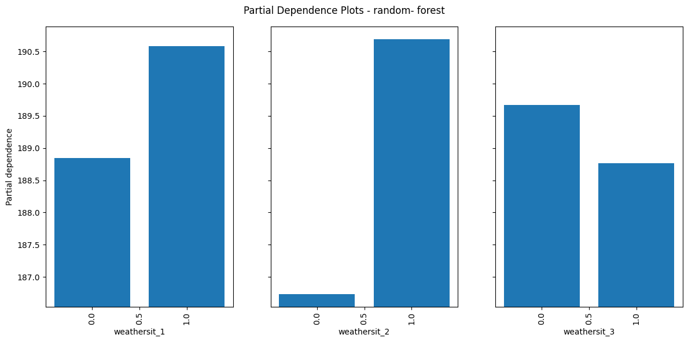

Pour la variable weathersit_2 on peut remarquer une différence importante entre la modalité 1 et 0.

Il semble qu'un temps avec peu de nuage semble bien plus intéressant qu'un temps sans nuage.

Dernier cas, on souhaite maintenant comparer des paires de features.

```python
# PDP pour tracer des features par paires. 
# Attention fonctionne unqiuement par paire de même type quali/quali ou quanti/quanti
features = ["temp","hum",("temp","hum"),("season_1","season_2"),'hr']  # Index des caractéristiques
_, ax1 = plt.subplots(figsize = (12,6))
PartialDependenceDisplay.from_estimator(rf, 
                                         X_train, 
                                         features,
                                         categorical_features=["season_1","season_2","hr"],
                                         kind="average",
                                         grid_resolution=50,
                                         ax = ax1
                                         )
plt.suptitle("Partial Dependence Plots - random- forest")
plt.tight_layout()
plt.show()

```

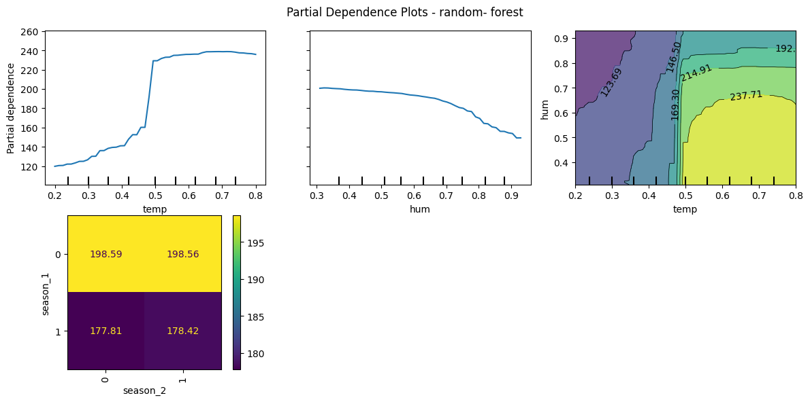

---

##### Avatanges :

Les PDP sont simlle à comprendre et permettent d'interpréter des relations linéaire ou non liénaires simplement.

Elles sont simple à implémenter et permettent de voir les effets joints de 2 variables sur notre Target.

Si votre Feature n'est pas corréelées avec les autres prédicteurs marginalisés l'interprétation se fait facilement.

---

##### Désanvatages:

Le **nombre de features maximun** pouvant être interprétés à la fois est de 2. Cela ne signifie pas que les PDP ne peuvent pas en utiliser plus mais il devient humainement impossible d'interpréter des relations en Dimension 3 ou plus.

Peut donner des relations falatieuse si on examine pas la réelle distribution réelle des données.

Les graphiques de dépendance partielle (PDP) supposent que les variables étudiées sont indépendantes des autres, ce qui peut mener à des résultats irréalistes lorsqu'elles sont corrélées.

**Exemple :**
Pour analyser l'effet de la taille et du poids sur la vitesse de marche, un PDP pourrait inclure des combinaisons improbables comme une taille de 2 mètres avec un poids inférieur à 50 kg. Cela crée des points dans des zones où la probabilité réelle est très faible, rendant les résultats moins fiables.

#### Accumulated Loccal Effect

##### Théorie

Lorsque les variables sont corrélées entre elle une alternative existe. Elle permet également d'éxaminer l'influence d'une feature sur votre target tout en étant non biaisé et moins couteuse en temps de calcul (pas de calcul sur l'ensemble des données).

Intuition :

Prenons l'exemple d'un jeu de données où l'on cherche le prix d'une maison sur le marché.

Pour cela nous avons des informations sur le bien comme , le nombre de pièces, la superficie, le type de pièce, ...

On lance un partial dépendance plot pour expliquer le prix du bien avec le nombre de pièces disponible tout en fixant les autres variables.

📏 Une variable fixée est la superfie du bien. Disons que celui-ci à pour valeur moyenne 40m² (on est à paris)📏

> Problème nos features sont coréllée et cela nous amène dans un espace qui n'a pas sens dans la réalité. Par exemple un appartement de 10 pièces qui feraient 40m²...

Dans ce type de cas les PDP offrent une représentation irréaliste de votre jeu de données et de fait une interprétation falacieuse.

Exemple : 2 Features corrélées X1 & X2

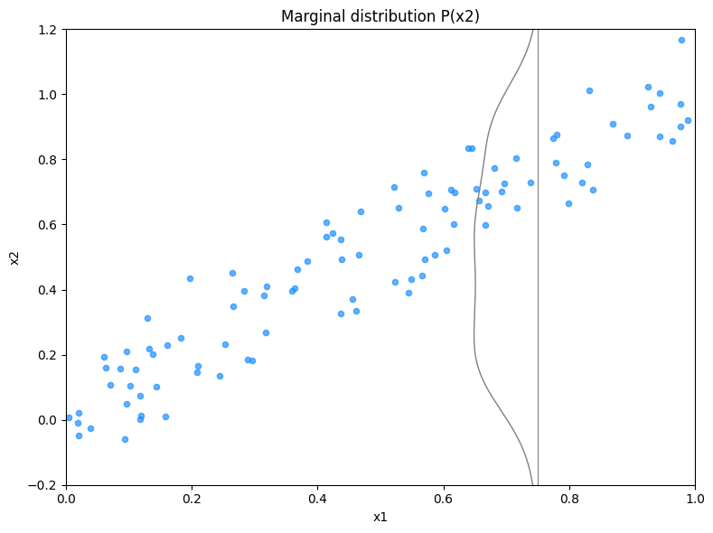

Graphique de de l'ALE:

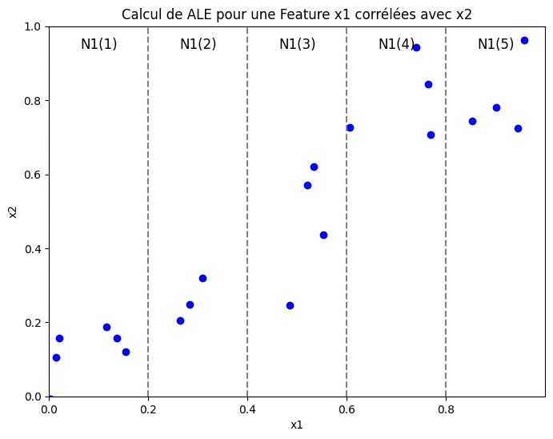

> On divise l'espace en 5 intervals suivant X1. Pour chaque individu dans chaque interval, nous calculons la différence de prédiction en remplacant les valeurs de X1 par la borne inf et la borne max de l'interval.

Traduction algorithmique :

1. Diviser les valeurs de votre features en interval (quantile ou interval égaux)
2. Affecter chaque instance à son interval et doubler les instance une pour le lower bond et l'autre pour le upper bon
3. Pour chaque instance calcule f(lower_bond) et le f(upper_bond)
4. Calculer la différence entre les 2 et moyenniser le réultat
5. Tracer le ALE

**Traduction algorithmique : Accumulated Local Effects (ALE)**

---

Étape 1 : Définir une grille d'intervalles ($I_k$) pour la feature $x_S$

1. Diviser les valeurs de $x_S$ en $K$ intervalles égaux ou basés sur les quantiles.
   - $I_k = [b_{k-1}, b_k)$ avec $k \in [1, K]$.

---

Étape 2 : Calculer les différences locales pour chaque intervalle

Pour chaque intervalle $I_k$ :

1. Identifier les instances $X_k$ dont la valeur de $x_S$ appartient à $I_k$.
2. Pour chaque instance $i$ dans $X_k$ :

   - Remplacer $x_S$ par la borne inférieure $b_{k-1}$ de $I_k$ et prédire :
   - $f_{i,\text{lower}} = f(X_i | x_S = b_{k-1})$
   - Remplacer $x_S$ par la borne supérieure $b_k$ de $I_k$ et prédire :
   - $f_{i,\text{upper}} = f(X_i | x_S = b_k)$
   - Calculer la différence locale pour l'instance :
   - $\Delta f_i^k = f_{i,\text{upper}} - f_{i,\text{lower}}$
3. Moyenniser les différences locales pour l'intervalle :

   $\Delta f^k = \frac{1}{|X_k|} \sum_{i \in X_k} \Delta f_i^k$

> 💡Prendre 2 bornes petites permet de faire varifer votre feature dans les 2 sens et ainsi observer les effets d'un chagement d'une petite quantité et l'effet sur votre prédiction..On moyennise ensuite cet effet pour chaque borne.

---

Étape 3 : Calculer les effets accumulés (ALE)

1. Initialiser $ALE_1 = 0$.
2. Pour chaque intervalle $I_k$ ($k > 1$) :

   - Accumuler les effets locaux :
     $ALE_k = ALE_{k-1} + \Delta f^k$
3. Optionnel : Centrer les ALE autour de zéro :

   $ALE_k = ALE_k - \frac{1}{K} \sum_{k=1}^K ALE_k$

> Note :  L'accumulation des effets permet d'interpréter l'ALE comme une courbe continue. Si elle est monotone et croissante cela signifique que chaque borne influence positivement notre variable cible.

---

Étape 4 : Visualiser les résultats

1. Construire les couples $(x_S^k, ALE_k)$, où $x_S^k$ est le centre ou la borne supérieure de chaque intervalle.
2. Tracer un graphique avec :
   - $x_S^k$ en abscisses,
   - $ALE_k$ en ordonnées.

---

##### Exemple et implémentation:

Pour implémenter les ALE en python vous pouvez utiliser le package `ALIBI` celui-ci est nettement évolué que son équivalent en dans le langage R [ALEPlot R](https://cran.r-project.org/web/packages/ALEPlot/index.html) ou [iml](https://cran.r-project.org/web/packages/iml/index.html) .

```python
from alibi.explainers import ALE, plot_ale

rf_ale = ALE(rf.predict, #Methode predict de votre modèle
             feature_names=features_names, # Liste des features où il faut calculer l'ALE
             target_names=["bike sell"] # Nom de la target
) 
#Calcul des ALE, attention il faut un format numpy arrray
rf_exp = rf_ale.explain(X_train.to_numpy()) 

#Plot pour l'interprétation

_, ax1 = plt.subplots(figsize = (10,8))
plot_ale(rf_exp, #Résultats des ALE
	 features=["temp","hum","windspeed"], # Feature à représenter
	 ax= ax1, 
	 targets=[0] # Si classification mutliple, passer le nom de toutes les modalités à prédire
)
```

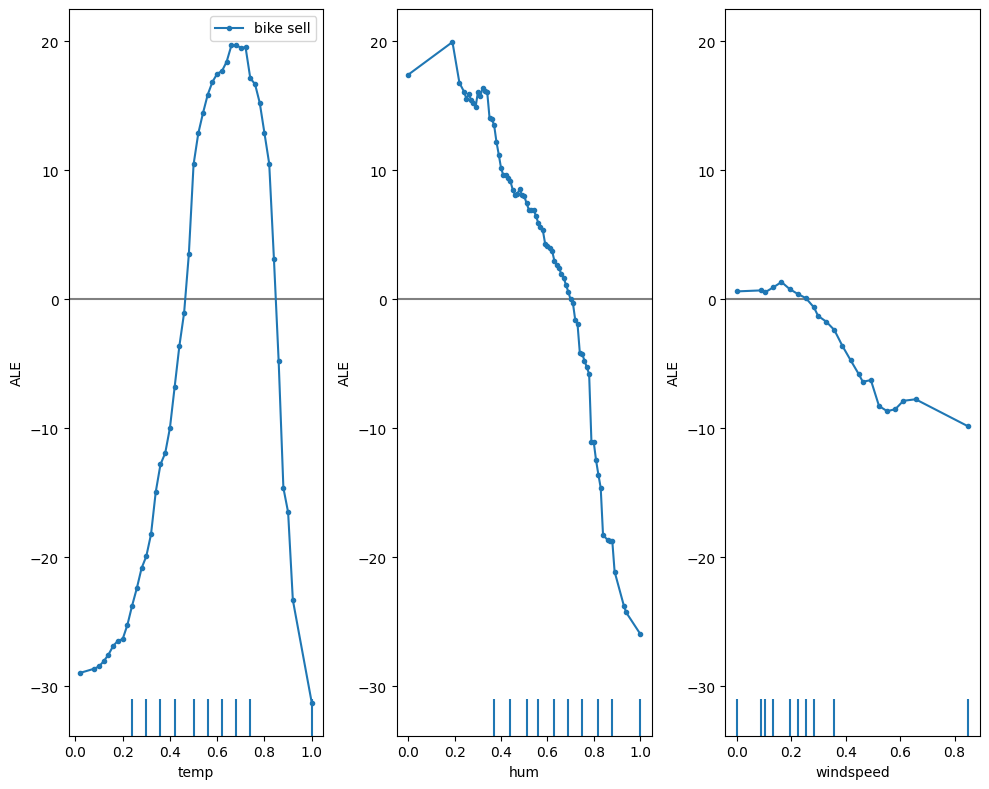

Ici l'interprétation est essentiellement qualitative. On cherche à éxaminer l'intéraction entre notre Feature et la target.

Pour rappel, la valeur de l'ALE en un point se lit de la façon suivante :

Une hausse de l'humidité sur l'interval [0.45,0.55] diminue la location de vélo de 5 unités en en tenant compte de l'influence des autres variables. Cet effet n'est valable que pour l'interval 0.45,0.55

##### Avantages:

Les **ALE sont non biaisés** en présence de features corréelées a la différence des PDP car marginaliseront des combinaisons improbables de données.

**ALE  sont plus rapide à calculer que les** PDPs qui ont une compléxité O(n) alors que celui des ALE est $O(B_k)$

**Les ALE plot** **sont centrées** en 0 ce qui facilite leur intrépétation. La lecture se fait comprativement à la moyenne des prédiction

##### Désavantages :

Fixer son interval peut être relativement compliqué et peut parfois produire des ALE plot très compliqué à lire. Dans ce cas diminuer le nombre d'intervalles.

La moyennisation des effets ne permet pas de voir l'hétérogétés des prédictions si elle existe.

L'implémentation et la compréhension est moins intuitive que les PDP

Même si les tracés ALE ne sont pas biaisés en cas de caractéristiques corrélées, l’interprétation reste difficile lorsque les caractéristiques sont fortement corrélées. Lors d'une très forte corrélation, il est logique d’analyser l’effet de la modification des deux caractéristiques ensemble et non isolément. Cet inconvénient n’est pas spécifique aux tracés ALE, mais constitue un problème général de caractéristiques fortement corrélées.

#### Feature interaction

##### Théorie

Quand nos features intéragissent entre elles dans un modèle notre prédiction ne peut être exprimée comme une somme indépendante de nos features. Car la valeur d'une feature dépendant directement de la valeur d'une autre.

> Exemple : Si $X_1$ représente l'âge et $X_2$ représente le revenu, leur interaction pourrait déterminer la probabilité qu'un individu souscrive un prêt (par exemple, les jeunes avec un revenu élevé pourraient être plus enclins à souscrire que les personnes âgées avec le même revenu).

Si un modèle de machine learning réalise des prédictions basées sur 2 features. Nous pouvons décomper la prédiction en 4 termes :

- Une constante
- Un effet du premier feature
- Un effet du second feature
- L'effet combiné des 2 features

Exemple d'un modèle prédisant la valeur d'un bien immobilier avec 2 features, taille de la maison (petit ou grand ) et la localisation (bien ou mauvais).

| localisation | taille | Prediction |
| -----------: | -----: | ---------: |
|         bien |  grand |    300,000 |
|         bien |  petit |    200,000 |
|     mauvaise |  grand |    250,000 |
|     mauvaise |  petit |    150,000 |

Ici, on décompose les prédictions du modèle en:

- Terme constant : 150 000$
- taille : 100 000 $ si grand, 0 sinon
- localisation : 50 000 $ si bien, 0 sinon

La décomposition est pleinement expliquée ici, il n'y a pas d'effet d'intéraction. L'effet indivuel des variables permet d'expliquer à 100% votre modèle.

Maintenant un exemplea avec interaction:

| localisation | taille | Prediction |
| -----------: | -----: | ---------: |
|         bien |  grand |    400,000 |
|         bien |  petit |    200,000 |
|     mauvaise |  grand |    250,000 |
|     mauvaise |  petit |    150,000 |

On décompose la prédiction en :

- Un terme constant: 150 000$
- L'effet taille : 100 000$ si grand, 0 sinon
- L'effet localisation : 50 000$ si bien, 0 sinon
- L'effet interaction taille/localisation : 100 000 $  si grand et bien, 0sinon

Une manière de mesurer cette intéraction est de calculer de combien varie la prédiction de notre modèle basée sur une légère variation des effets d'intéraction.

Cette méthode s'appelle le **Friedman's H-statistic**

##### Résumé : H-statistic de Friedman

---

##### 2. Définition de base des interactions

- **Absence d'interaction entre deux features :**
  $PD_{jk}(x_j, x_k) = PD_j(x_j) + PD_k(x_k)$

  - $PD_{jk}$ : Partial Dependence Function (PDP) combinée des deux features.
  - $PD_j$, $PD_k$ : PDP de chaque feature séparément.
- **Absence d'interaction entre une feature et toutes les autres :**
  $\hat{f}(x) = PD_j(x_j) + PD_{-j}(x_{-j})$

  - $\hat{f}(x)$ : Prédiction totale.
  - $PD_{-j}(x_{-j})$ : PDP combinée pour toutes les features sauf $j$.

---

###### 3. Calcul de la H-statistic

La H-statistic mesure la variance expliquée par la différence entre le comportement observé (avec interactions) et celui sans interactions.

###### Interaction entre deux features $(H_{jk}^2)$ :

$H_{jk}^2 = \frac{\sum_{i=1}^n \big[ PD_{jk}(x_j^{(i)}, x_k^{(i)}) - PD_j(x_j^{(i)}) - PD_k(x_k^{(i)}) \big]^2}{\sum_{i=1}^n PD_{jk}^2(x_j^{(i)}, x_k^{(i)})}$

- **Numérateur :** Variance de la différence entre $PD_{jk}$ (PDP combinée) et $PD_j + PD_k$ (PDP individuelles).
- **Dénominateur :** Variance totale de $PD_{jk}$.

###### Interaction entre une feature et toutes les autres $(H_j^2)$ :

$H_j^2 = \frac{\sum_{i=1}^n \big[ \hat{f}(x^{(i)}) - PD_j(x_j^{(i)}) - PD_{-j}(x_{-j}^{(i)}) \big]^2}{\sum_{i=1}^n \hat{f}^2(x^{(i)})}$

- **Numérateur :** Variance expliquée par la différence entre $\hat{f}(x)$ (prédiction totale) et $PD_j + PD_{-j}$ (PDP sans interactions).
- **Dénominateur :** Variance totale des prédictions $\hat{f}(x)$.

---

###### 4. Interprétation des résultats

- $H = 0$ : Aucune interaction.
- $H = 1$ : L'effet des features provient uniquement des interactions (leurs PDP individuelles sont constantes).
- $H > 1$ : Rare, cela peut arriver si la variance des interactions dépasse la variance totale, mais ce cas est difficile à interpréter.

---

###### 5. Problèmes pratiques du calcul

- **Complexité computationnelle :**  Le calcul de la statisique nécesside au mieux $2n^2$ pour calculer la H-statistic (j vs. k) et $3n^2$ pour la H-statistic (j vs. all).
- **Échantillonnage :** Réduit la complexité, mais peut rendre les résultats instables.

---

##### Exemple et implémentation:

- Utilisez la **H-statistic** pour détecter et quantifier les interactions importantes.
- Si des interactions fortes sont détectées :

  - Adaptez le modèle (e.g., modèles non linéaires, termes d'interaction explicites).
  - Réalisez une analyse approfondie des interactions pour guider l'amélioration ou l'interprétation du modèle.

```python
from sklearn.datasets import fetch_openml
from sklearn.preprocessing import OneHotEncoder
from sklearn.pipeline import Pipeline
from sklearn.compose import ColumnTransformer
from sklearn.svm import LinearSVR

#Fichier de données contenant les ventes de vélo tous les 5 jours
bikes = fetch_openml("Bike_Sharing_Demand", version=2, as_frame=True)

X, y = bikes.data.copy(), bikes.target

# We use only a subset of the data to speed up the example.
X = X.iloc[::5, :]
y = y[::5]
```

```python
categorical_features = X.select_dtypes(include=['category']).columns

preprocessor = ColumnTransformer(
    transformers=[
        ('cat', categorical_transformer, categorical_features)
    ])

# Création du pipeline complet
pipeline = Pipeline(steps=[
    ('preprocessor', preprocessor),
    ('regressor', RandomForestRegressor(random_state=0, min_samples_leaf=10, max_depth=3,min_samples_split=5))
])

# Random Forest Regressor
model = pipeline.fit(X, y)


```

```python
# On restreint le nombre d'observations à prédire pour accélerer le compute
random.seed(8)
X_exp = random.choices(X.to_numpy(), k=100)
X_exp = pd.DataFrame(X_exp, columns=X.columns)

h_stat = FriedmanHStatisticMethod()
h_stat.fit(model, X_exp)

```

```python
# Participation de votre feature et son interaction dans la variance globale
h_stat.plot(vis_type="bar_chart_ova")
```

> Ce graphique montre la pusisance d'intéraction (H-statistic) pour chaque feature avec les autres . Ici les effets d'intéractions en entre les features son vraiment faibles (mois de 10% de la variance expliquée par feature).

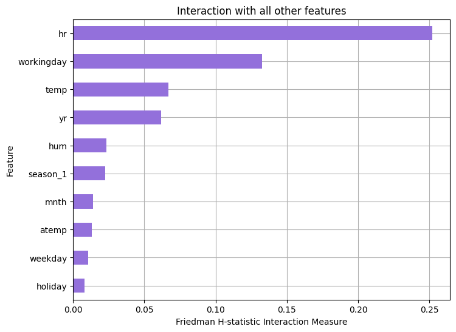

Les effets d'intéractions :

```python
# Pair d'intéraction et son intensité
h_stat.plot(vis_type="bar_chart", ,top_k=5 )
```

> On peut également observer les effets d'intéraction par paire de variables.

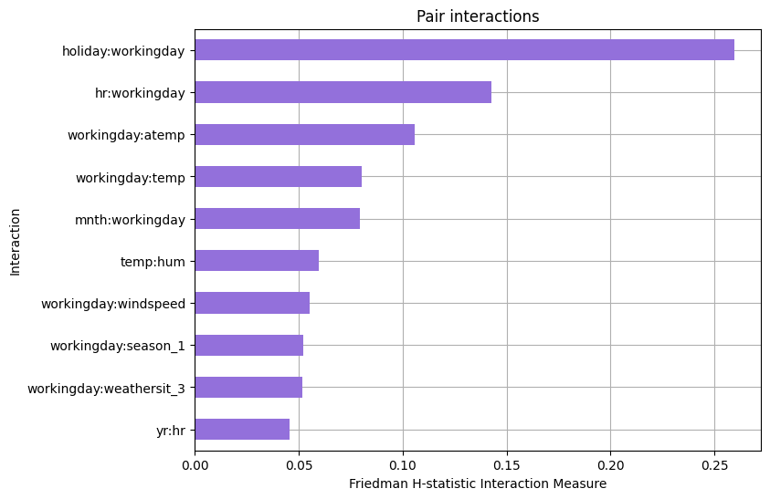

##### Avantages :

- L'interprétation se fait facilement, on représente la part de variance expliquée par l'intéraction de la feature et non pas son effet individuel.
- On peut comparer cette statistique d'un modèle à l'autre
- Elle détecte toute forme d'intéraction

##### Désavantages

- La statistique est très très couteuse en compute et nous force à travailler sur des échantillons
- Pas de tests statistiques fournies pour emettre une hypothèse d'intéraction ou non
- Pas de threshold pour définir une intéraction par exemple intéraction >0.3

#### Permutation Feature importance

##### Théorie

⚠️ Connaitre la notion de feature importance est un pré-requis.

Le concept est très simple : nous mesurons l’importance d’une feature en calculant l’augmentation de l’erreur de prédiction du modèle après permutation des caractèristiques du feature.

Une caractéristique est **« importante »** si le mélange de ses valeurs augmente l'erreur du modèle, car dans ce cas, le modèle s'est appuyé sur la caractéristique pour la prédiction.

Une caractéristique est **« sans importance »** si le mélange de ses valeurs laisse l’erreur du modèle inchangée, car dans ce cas, le modèle a ignoré la caractéristique pour la prédiction.

###### Traduction algorithmique : Feature permutation importance

---

Input: Un modèle entrainé $\hat{f}$, une matrice de vos features $X$, un vecteur contenant la target $y$, la mesure des erreurs de prédictions $L(y,\hat{f})$.

1. Estimer les erreurs originelles du modèle $e_{orig} = L(y, \hat{f}(X))$  (i.e. mean squared error)
2. Pour chaque feature $j \in \{1,...,p\}$ faire:
   - Générer une matrice de feature $X_{perm}$ en permutant  la feature j dans le jeu de données X. Cela aura pour effet de "casser" l'association entre la feature j et y.
   - Estimer l'erreur $e_{perm} = L(Y,\hat{f}(X_{perm}))$ basée sur les prédictions des données permutées.
   - Calculer la permutation feature importance comme un quotient $FI_j= e_{perm}/e_{orig}$ ou la différence $FI_j = e_{perm}- e_{orig}$
3. Ordonner les  features par desc FI.

---

##### Exemple et implémentation :

```python
from sklearn.inspection import permutation_importance
random_permutation = permutation_importance(model, X, y,
                           			n_repeats=30,
                           			random_state=0)
```

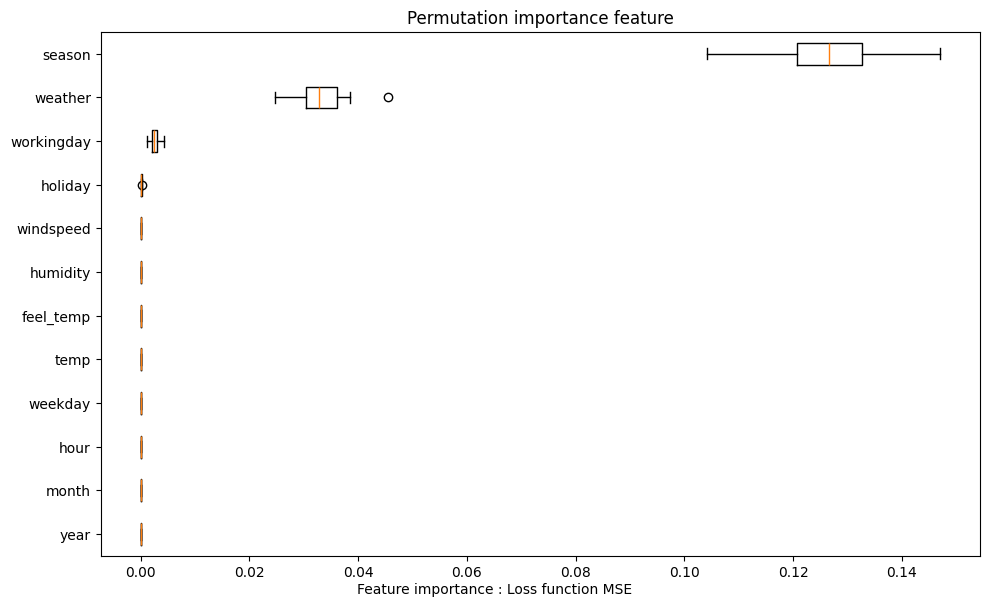

> Permuter la variable season conduit à une augmentation du MSE de 0.13

##### Avantages :

- Facilter à interpréter : Le feature importance montre de combien on augmente l'erreur du modèle quand l'information est détruite
- La permutation ne nécessite pas de réentrainer le modèle !!
- La permutation supprime l'effet univariée de notre variable sur la target mais également les effets joints avec la distribution des autres variables. Cela à tendance à surestimer l'effet de la variable car elle porte l'effet individuel et l'effet collectif

##### Désavantages:

- Comme on permute la valeur des features de façon aléatoire cela introduit un biais. Si on relance une seconde fois la permutation peut être différent et donner des résultats totalement différent. Pour diminuer cette effet il est conseiller de réaliser plusieurs fois cette permutation.
- Comme pour les PDP, si les features sont coréllées ont peut biaiser les résulats avec des valeurs n'existant pas
