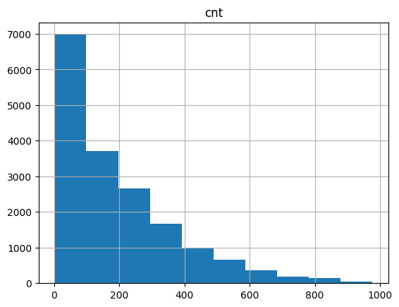
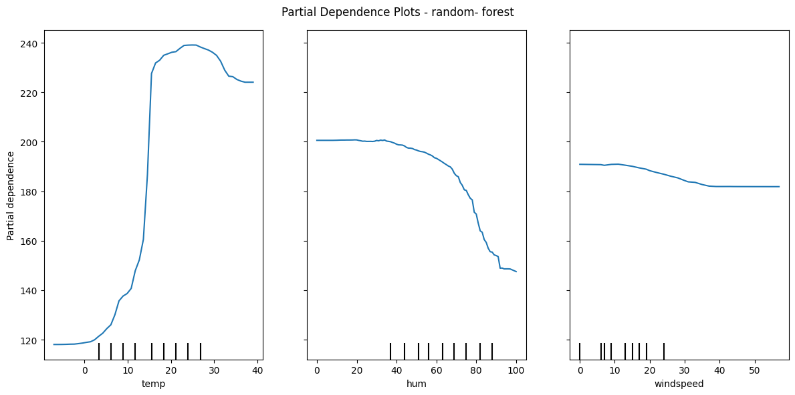
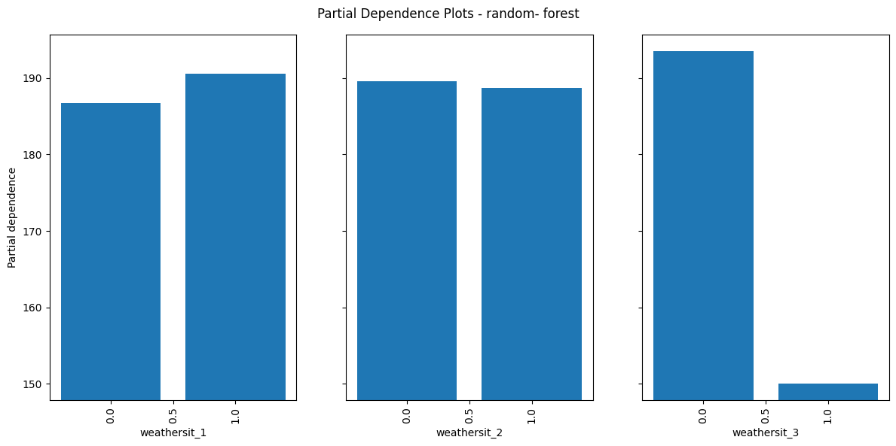
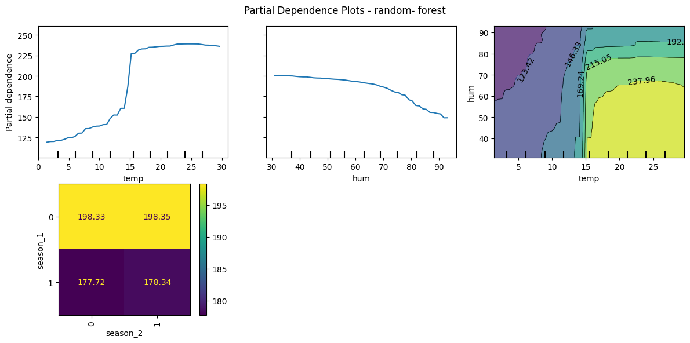
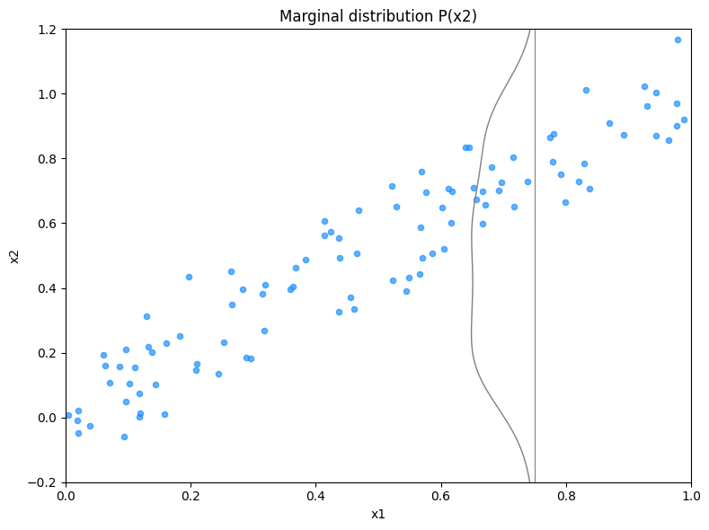
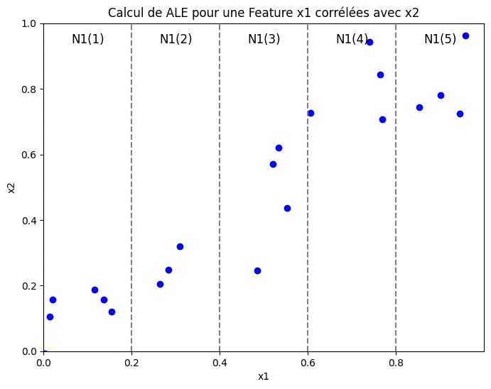
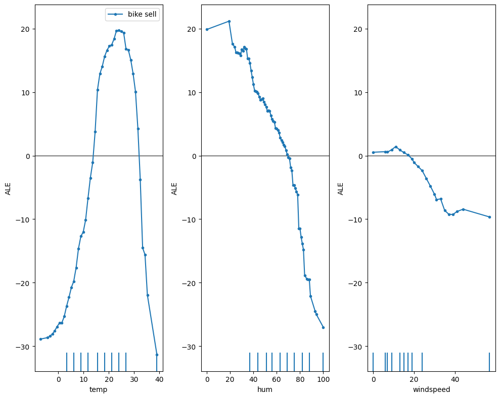
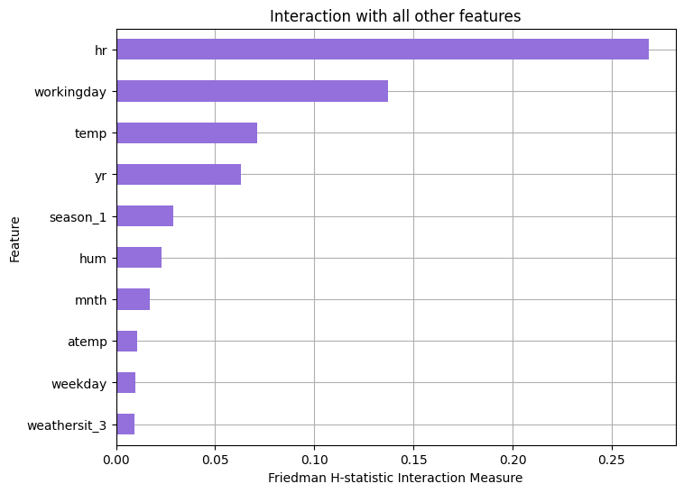
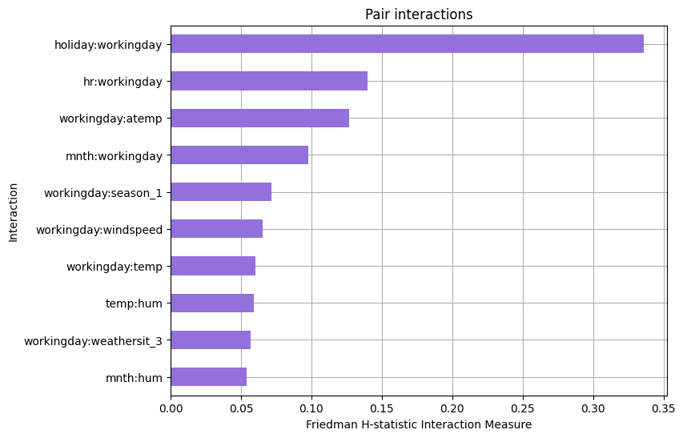

### Modèle Linéaire et interprétation

Pour illustrer ce cours nous allons utiliser le dataset Bike Rental Data. Celui-ci regroupe des informations journalières sur la location de vélo par une agence.

Le dataset contient des features sur :

- Données météo :  Température, humidité, vent, ...
- Dates : Heures, jours, jours fériés, vacances, ...
- Le nombre de vélo loué par jour

Voici l'exemple d'une instance pour mieux comprendre :

| dteday     | season | yr | mnth | hr | holiday | weekday | workingday | weathersit | temp | atemp  | hum | windspeed |
| ---------- | ------ | -- | ---- | -- | ------- | ------- | ---------- | ---------- | ---- | ------ | --- | --------- |
| 2011-01-01 | 1      | 0  | 1    | 0  | 0       | 6       | 0          | 1          | 3.28 | 3.0014 | 81  | 0         |

On réalise une régression sur ce modèle pour mieux comprendre les liens entre variables explicatives et la target (vente de vélo)

```python
from sklearn.linear_model import LinearRegression
from ucimlrepo import fetch_ucirepo 

# fetch dataset 
bike_sharing = fetch_ucirepo(id=275) 
  
# data (as pandas dataframes) 
X = bike_sharing.data.features 
y = bike_sharing.data.targets 


#Initialiser la régression linéaire
lr = LinearRegression()
#Fit the model
lr.fit(X.drop('dteday',axis=1), y)

#On affiche la valeur des coéfficients pour pouvoir les comparer
print(pd.DataFrame(np.abs(lr.coef_[0]),index=X.drop('dteday',axis=1).columns,columns=['abs(coef)']))
```

Les données étant centrées et réduites nous pouvons comparer les coefficients et leur ordre de grandeur. Ici les données sont en valeur absolue, on cherche uniquement à voir celle qui affecte le plus le modèle.

| Variable   | abs(coef)            | coef                  |
| ---------- | -------------------- | --------------------- |
| season     | 19.899338            | 19.899338             |
| yr         | 81.087156            | 81.087156             |
| mnth       | 0.008648             | -0.008648             |
| hr         | 7.670597             | 7.670597              |
| holiday    | 21.879216            | -21.879216            |
| weekday    | 1.878354             | 1.878354              |
| workingday | 3.939225             | 3.939225              |
| weathersit | 3.432098             | -3.432098             |
| temp       | 78.149780            | 78.149780             |
| atemp      | **233.157087** | 233.157087            |
| hum        | **198.184681** | -**198.184681** |
| windspeed  | 41.565215            | 41.565215             |

On remarque ici que les features atemp, hum et yr sont les trois variables les plus importantes du modèle. On peut compléter ces informations en regardant également le signe des coéfficients.

On peut également interpréter la qualité de notre modèle avec son $RMSE = 141$  et son $R^2 = 0.38$



**Conclusion :**

Les modèles linéaires offrent une capacité d'interprétation simpliste. On comprend rapidement comment le modèle prédit un individu et quels sont ses paramètres internes.

En revanche, ces interprétations se basent souvent sur des modèles offrant une capacité de généralisation bien faible (RMSE,R² faible) et ne parviennent pas à capturer des données complexes comportant des relations non liénaires.

### Global Model Agnostic

Les méthodes globales décrivent le comportement **moyen** de votre modèle de Machine Learning. Elles sont particulièrement utiles lorsqu'il s'agit de comprendre les mécanismes généraux de votre modèle et ainsi le valider ou l'invalider.

Dans ce cours nous étudierons les méthodes suivantes :

- **Partial dependance plot :**  Effet marginal d'une variable (qualitative ou quantitvative) sur la target
- **Accumulated Local Effect :** Effet marginal d'une variable par interval sur la target (quanti)
- **Feature Interaction (H-statistic) :** Quantifie les effets joints des variables
- **Feature Importance :** Mesure l'effet d'une feature sur la fonction de perte

#### Partial Depence plot

##### Théorie

Le partial depence plot ou (PDP) nous montre l'effet marginal d'une ou 2 variables sur la target que nous cherchons à prédire. PDP peut donc nous montrer la nature de la relation existante entre une variable du modèle et la target que celle-ci soit linaire ou non linéaire, monotone ou même plus complexe.

$\hat{f}_S(x_S)=E_{X_C}\left[\hat{f}(x_S,X_C)\right]=\int\hat{f}(x_S,X_C)d\mathbb{P}(X_C)$

Avec :

* $x_S$ : les variables pour lesquelles on veut analyser l'effet sur la prédiction.
* $X_C$ : les autres variables participant à votre modèle.
* $\hat{f}$ : fonction de dépendance partielle

Pour une unique variable on peut définir la PDP comme suiit :

---

**Traduction algorithmique :**

Le modèle ayant déjà été construit, on le calcule de la manière suivante pour une variable $x_S$ d’un ensemble de données de taille ‘’n’’ (qui peut être l’échantillon d’apprentissage) :

a. Définir une grille de M valeurs ($V_m$) également répartis entre $min(x_S)$  et $max(x_S)$

b. Pour chaque valeur $V_m$

1. Remplacer, dans la matrice des descripteurs X, les valeurs de $x_S$ par $V_m$
2. Appliquer le modèle sur cette matrice pour obtenir les probabilités d’affectation (π)

   à la classe cible
3. Calculer les moyennes de ces probabilités (𝜋̅𝑚)

   c. Les couples ($V_m$, 𝜋̅𝑚) constituent les points du graphique de dépendance partielle

c. Visualiser les résultats du partial depence plot.

---

##### Exemple et implémentation:

```python

 from sklearn.inspection import partial_dependence, PartialDependenceDisplay


# Définir nos variables d'intérêts dans une liste

features = ["temp","hum","windspeed"]  # Index des caractéristiques

_, ax1 = plt.subplots(figsize = (12,6))

PartialDependenceDisplay.from_estimator(rf, # votre modèle

                                         X_train, # Jeu d'entrainement

                                         features, # features

                                         kind="average", # Pour obtenir une PDP

                                         grid_resolution=50, Nombre de points estimés pour le tracer de la courbe

                                         ax = ax1 # Paramètre de matplotlib

   

                                         )

plt.suptitle("Partial Dependence Plots - random- forest")

plt.tight_layout()

plt.show()


```

Cela à pour effet de tracer les courbes de dépendences partielles suivantes :



**Température :**

Plus la température augmente plus la vente de vélos semble importantes avec un palier.

**Humité :**

Plus l'humidité augmente plus la vente de vélo va diminuer

**Vitesse du vent:**

Jusqu'à 35km/h la vente de vélo ne change pas énormement

Cas avec des variables catégorielles :

```python

#On passe nos variables OHE

features = ["weathersit_1","weathersit_2","weathersit_3"]  # Index des caractéristiques

_, ax1 = plt.subplots(figsize = (12,6))

PartialDependenceDisplay.from_estimator(rf, 

                                         X_train, 

                                         features,

                                         categorical_features=["weathersit_1","weathersit_2","weathersit_3"], # On spécifie ici les variables catégorielles

                                         kind="average",

                                         grid_resolution=50,

                                         ax = ax1,

                                         n_cols=4

   

                                         )

plt.suptitle("Partial Dependence Plots - random- forest")

plt.tight_layout()

plt.show()


```

Résulats :



Pour la variable weathersit_2 on peut remarquer une différence importante entre la modalité 1 et 0.

Il semble qu'un temps avec peu de nuages semble bien plus intéressant qu'un temps sans nuage.

Dernier cas, on souhaite maintenant comparer des paires de features.

```python

# PDP pour tracer des features par paires. 

# Attention fonctionne unqiuement par paire de même type quali/quali ou quanti/quanti

features = ["temp","hum",("temp","hum"),("season_1","season_2"),'hr']  # Index des caractéristiques

_, ax1 = plt.subplots(figsize = (12,6))

PartialDependenceDisplay.from_estimator(rf, 

                                         X_train, 

                                         features,

                                         categorical_features=["season_1","season_2","hr"],

                                         kind="average",

                                         grid_resolution=50,

                                         ax = ax1

                                         )

plt.suptitle("Partial Dependence Plots - random- forest")

plt.tight_layout()

plt.show()


```



---

##### Avatanges :

Les PDP sont simples à comprendre et permettent d'interpréter des relations linéaires ou non linéaires.

Elles sont simples à implémenter et permettent de voir les effets joints de 2 variables sur notre Target.

Si votre Feature n'est pas corrélée avec les autres prédicteurs marginalisés l'interprétation est valide.

---

##### Désanvatages:

Le **nombre de features maximum** pouvant être interprétées à la fois est de 2. Cela ne signifie pas que les PDP ne peuvent pas en utiliser plus mais il devient humainement impossible d'interpréter des relations en Dimension 3 ou plus.

Peut donner des relations fallacieuses si on n'examine pas la réelle distribution réelle des données.

Les graphiques de dépendance partielle (PDP) supposent que les variables étudiées sont indépendantes des autres, ce qui peut mener à des résultats irréalistes lorsqu'elles sont corrélées.

**Exemple :**

> Pour analyser l'effet de la taille et du poids sur la vitesse de marche, un PDP pourrait inclure des combinaisons improbables comme une taille de 2 mètres avec un poids inférieur à 50 kg. Cela crée des points dans des zones où la probabilité réelle est très faible, rendant les résultats moins fiables.

#### Accumulated Loccal Effect

##### Théorie

Lorsque les variables sont corrélées entre elles, une alternative existe. Cette alternative permet d'évaluer l'influence d'une feature sur votre target tout en étant non biaisée et moins coûteuse en temps de calcul (pas de calcul sur l'ensemble des données).

**Intuition :**

Prenons l'exemple d'un jeu de données où l'on cherche le prix d'une maison sur le marché.

Pour cela nous avons des informations sur le bien comme, le nombre de pièces, la superficie, le type de pièce, ...

On lance un partial dépendance plot pour expliquer le prix du bien avec le nombre de pièces disponibles tout en fixant les autres variables.

📏 Une variable fixée est la superfie du bien. Disons que celui-ci à pour valeur moyenne 40m² (on est à paris)📏

> Problème nos features sont corrélées et cela nous amène dans un espace qui n'a pas sens dans la réalité. Par exemple un appartement de 10 pièces qui feraient 40m²...

Dans ce type de cas les PDP offrent une représentation irréaliste de votre jeu de données et de fait une interprétation fallacieuse.

Exemple : 2 Features corrélées X1 & X2



Graphique de de l'ALE:



> On divise l'espace en 5 intervalles suivant X1. Pour chaque individu dans chaque interval, nous calculons la différence de prédiction en remplacant les valeurs de X1 par la borne inf et la borne max de l'interval.

**Traduction intuitive:**

1. Diviser les valeurs de votre features en interval (quantile ou interval égaux)
2. Affecter chaque instance à son interval et doubler les instance une pour le lower bond et l'autre pour le upper bon
3. Pour chaque instance calcule f(lower_bond) et le f(upper_bond)
4. Calculer la différence entre les 2 et moyenniser le réultat
5. Tracer le ALE

**Traduction algorithmique : Accumulated Local Effects (ALE)**

---

Étape 1 : Définir une grille d'intervalles ($I_k$) pour la feature $x_S$

1. Diviser les valeurs de $x_S$ en $K$ intervalles égaux ou basés sur les quantiles.

   - $I_k = [b_{k-1}, b_k)$ avec $k \in [1, K]$.

---

Étape 2 : Calculer les différences locales pour chaque intervalle

Pour chaque intervalle $I_k$ :

1. Identifier les instances $X_k$ dont la valeur de $x_S$ appartient à $I_k$.
2. Pour chaque instance $i$ dans $X_k$ :

   - Remplacer $x_S$ par la borne inférieure $b_{k-1}$ de $I_k$ et prédire :
   - $f_{i,\text{lower}} = f(X_i | x_S = b_{k-1})$
   - Remplacer $x_S$ par la borne supérieure $b_k$ de $I_k$ et prédire :
   - $f_{i,\text{upper}} = f(X_i | x_S = b_k)$
   - Calculer la différence locale pour l'instance :
   - $\Delta f_i^k = f_{i,\text{upper}} - f_{i,\text{lower}}$
3. Moyenniser les différences locales pour l'intervalle :

   $\Delta f^k = \frac{1}{|X_k|} \sum_{i \in X_k} \Delta f_i^k$

> 💡Prendre 2 bornes petites permet de faire varier votre feature dans les 2 sens et ainsi observer les effets d'un chagement d'une petite quantité et l'effet sur votre prédiction..On moyennise ensuite cet effet pour chaque borne.

---

Étape 3 : Calculer les effets accumulés (ALE)

1. Initialiser $ALE_1 = 0$.
2. Pour chaque intervalle $I_k$ ($k > 1$) :

   - Accumuler les effets locaux :

     $ALE_k = ALE_{k-1} + \Delta f^k$
3. Optionnel : Centrer les ALE autour de zéro :

   $ALE_k = ALE_k - \frac{1}{K} \sum_{k=1}^K ALE_k$

> Note :  L'accumulation des effets permet d'interpréter l'ALE comme une courbe continue. Si elle est monotone et croissante cela signifique que chaque borne influence positivement notre variable cible.

---

Étape 4 : Visualiser les résultats

1. Construire les couples $(x_S^k, ALE_k)$, où $x_S^k$ est le centre ou la borne supérieure de chaque intervalle.
2. Tracer un graphique avec :

   - $x_S^k$ en abscisses,
   - $ALE_k$ en ordonnées.

---

##### Exemple et implémentation:

Pour implémenter les ALE en python vous pouvez utiliser le package `ALIBI` celui-ci est nettement moins évolué que son équivalent en dans le langage R [ALEPlot R](https://cran.r-project.org/web/packages/ALEPlot/index.html) ou [iml](https://cran.r-project.org/web/packages/iml/index.html) .

```python

from alibi.explainers importALE, plot_ale


rf_ale = ALE(rf.predict, #Methode predict de votre modèle

             feature_names=features_names, # Liste des features où il faut calculer l'ALE

             target_names=["bike sell"] # Nom de la target

) 

#Calcul des ALE, attention il faut un format numpy arrray

rf_exp = rf_ale.explain(X_train.to_numpy()) 


#Plot pour l'interprétation


_, ax1 = plt.subplots(figsize = (10,8))

plot_ale(rf_exp, #Résultats des ALE

     features=["temp","hum","windspeed"], # Feature à représenter

     ax= ax1, 

     targets=[0] # Si classification mutliple, passer le nom de toutes les modalités à prédire

)

```



Ici l'interprétation est essentiellement qualitative. On cherche à éxaminer l'interaction entre notre Feature et la target.

Pour rappel, la valeur de l'ALE en un point se lit de la façon suivante :

Une hausse de l'humidité sur l'interval [0.45,0.55] diminue la location de vélo de 5 unités en en tenant compte de l'influence des autres variables. Cet effet n'est valable que pour l'interval 0.45,0.55

##### Avantages:

Les **ALE sont non biaisés** en présence de features corréelées à la différence des PDP car marginaliseront des combinaisons improbables de données.

**ALE  sont plus rapides à calculer que les** PDPs qui ont une complexité O(n) alors que celui des ALE est $O(B_k)$

Les ALE plot **sont centrées** en 0 ce qui facilite leur intrépétation. La lecture se fait comprativement à la moyenne des prédiction

##### Désavantages :

Fixer son intervalle peut être relativement compliqué et peut parfois produire des ALE plots très compliqués à lire. Dans ce cas diminuer le nombre d'intervalles.

La moyennisation des effets ne permet pas de voir l'hétérogénéité  des prédictions si elle existe.

L'implémentation et la compréhension sont moins intuitives que les PDP

Même si les tracés ALE ne sont pas biaisés en cas de caractéristiques corrélées, l’interprétation reste difficile lorsque les caractéristiques sont fortement corrélées. Lors d'une très forte corrélation, il est logique d’analyser l’effet de la modification des deux caractéristiques ensemble et non isolément. Cet inconvénient n’est pas spécifique aux tracés ALE, mais constitue un problème général de caractéristiques fortement corrélées.

#### Feature interaction

##### Théorie

Quand nos features interagissent entre elles dans un modèle notre prédiction ne peut être exprimée comme une somme indépendante de nos features. Car la valeur d'une feature dépendant directement de la valeur d'une autre.

> Exemple : Si $X_1$ représente l'âge et $X_2$ représente le revenu, leur interaction pourrait déterminer la probabilité qu'un individu souscrive un prêt (par exemple, les jeunes avec un revenu élevé pourraient être plus enclins à souscrire que les personnes âgées avec le même revenu).

Si un modèle de machine learning réalise des prédictions basées sur 2 features. Nous pouvons décomper la prédiction en 4 termes :

- Une constante
- Un effet du premier feature
- Un effet du second feature
- L'effet combiné des 2 features

Exemple d'un modèle prédisant la valeur d'un bien immobilier avec 2 features, taille de la maison (petit ou grand ) et la localisation (bien ou mauvais).

| localisation | taille | Prediction |
| ------------ | ------ | ---------- |
| bien         | grand  | 300,000    |
| bien         | petit  | 200,000    |
| mauvaise     | grand  | 250,000    |
| mauvaise     | petit  | 150,000    |

Ici, on décompose les prédictions du modèle en:

- Terme constant : 150 000$
- taille : 100 000 $ si grand, 0 sinon
- localisation : 50 000 $ si bien, 0 sinon

La décomposition est pleinement expliquée ici, il n'y a pas d'effet d'intéraction. L'effet indivuel des variables permet d'expliquer à 100% votre modèle.

Maintenant un exemplea avec interaction:

| localisation | taille | Prediction |
| ------------ | ------ | ---------- |
| bien         | grand  | 400,000    |
| bien         | petit  | 200,000    |
| mauvaise     | grand  | 250,000    |
| mauvaise     | petit  | 150,000    |

On décompose la prédiction en :

- Un terme constant: 150 000$
- L'effet taille : 100 000$ si grand, 0 sinon
- L'effet localisation : 50 000$ si bien, 0 sinon
- L'effet interaction taille/localisation : 100 000 $  si grand et bien, 0sinon

Une manière de mesurer cette interaction est de calculer de combien varie la prédiction de notre modèle basée sur une légère variation des effets d'interaction.

Cette méthode s'appelle le **Friedman's H-statistic**

##### Résumé : H-statistic de Friedman

---

##### 2. Définition de base des interactions

**Absence d'interaction entre deux features peut être exprimé de la façon suivante :**

  $PD_{jk}(x_j, x_k) = PD_j(x_j) + PD_k(x_k)$

- $PD_{jk}$ : Partial Dependence Function (PDP) combinée des deux features.
- $PD_j$, $PD_k$ : PDP de chaque feature séparément.

**S'il n'y a pas d'intéraction entre un feature et les autres, on peut exprimer une prédiction comme suit :**

  $\hat{f}(x) = PD_j(x_j) + PD_{-j}(x_{-j})$

- $\hat{f}(x)$ : Prédiction totale.
- $PD_{-j}(x_{-j})$ : PDP combinée pour toutes les features sauf $j$.

---

###### 3. Calcul de la H-statistic

La H-statistic mesure la variance expliquée par la différence entre le comportement observé (avec interactions) et celui sans interactions.

###### Interaction entre deux features $(H_{jk}^2)$ :

$H_{jk}^2 = \frac{\sum_{i=1}^n \big[ PD_{jk}(x_j^{(i)}, x_k^{(i)}) - PD_j(x_j^{(i)}) - PD_k(x_k^{(i)}) \big]^2}{\sum_{i=1}^n PD_{jk}^2(x_j^{(i)}, x_k^{(i)})}$

-**Numérateur :** Variance de la différence entre $PD_{jk}$ (PDP combinée) et $PD_j + PD_k$ (PDP individuelles).

-**Dénominateur :** Variance totale de $PD_{jk}$.

###### Interaction entre une feature et toutes les autres $(H_j^2)$ :

$H_j^2 = \frac{\sum_{i=1}^n \big[ \hat{f}(x^{(i)}) - PD_j(x_j^{(i)}) - PD_{-j}(x_{-j}^{(i)}) \big]^2}{\sum_{i=1}^n \hat{f}^2(x^{(i)})}$

-**Numérateur :** Variance expliquée par la différence entre $\hat{f}(x)$ (prédiction totale) et $PD_j + PD_{-j}$ (PDP sans interactions).

-**Dénominateur :** Variance totale des prédictions $\hat{f}(x)$.

---

###### 4. Interprétation des résultats

- $H = 0$ : Aucune interaction.
- $H = 1$ : L'effet des features provient uniquement des interactions (leurs PDP individuelles sont constantes).
- $H > 1$ : Rare, cela peut arriver si la variance des interactions dépasse la variance totale, mais ce cas est difficile à interpréter.

---

###### 5. Problèmes pratiques du calcul

- **Complexité computationnelle :**  Le calcul de la statisique nécesside au mieux $2n^2$ pour calculer la H-statistic (j vs. k) et $3n^2$ pour la H-statistic (j vs. all).
- **Échantillonnage :** Réduit la complexité, mais peut rendre les résultats instables.

---

##### Exemple et implémentation:

- Utilisez la **H-statistic** pour détecter et quantifier les interactions importantes.
- Si des interactions fortes sont détectées :

  - Adaptez le modèle (e.g., modèles non linéaires, termes d'interaction explicites).
  - Réalisez une analyse approfondie des interactions pour guider l'amélioration ou l'interprétation du modèle.

```python

from sklearn.datasets import fetch_openml

from sklearn.preprocessing import OneHotEncoder

from sklearn.pipeline import Pipeline

from sklearn.compose import ColumnTransformer

from sklearn.svm import LinearSVR


#Fichier de données contenant les ventes de vélo tous les 5 jours

bikes = fetch_openml("Bike_Sharing_Demand", version=2, as_frame=True)


X, y = bikes.data.copy(), bikes.target


# We use only a subset of the data to speed up the example.

X = X.iloc[::5, :]

y = y[::5]

```

```python

categorical_features = X.select_dtypes(include=['category']).columns


preprocessor = ColumnTransformer(

    transformers=[

        ('cat', categorical_transformer, categorical_features)

    ])


# Création du pipeline complet

pipeline = Pipeline(steps=[

    ('preprocessor', preprocessor),

    ('regressor', RandomForestRegressor(random_state=0, min_samples_leaf=10, max_depth=3,min_samples_split=5))

])


# Random Forest Regressor

model = pipeline.fit(X, y)


```

```python

# On restreint le nombre d'observations à prédire pour accélerer le compute

random.seed(8)

X_exp = random.choices(X.to_numpy(), k=100)

X_exp = pd.DataFrame(X_exp, columns=X.columns)


h_stat = FriedmanHStatisticMethod()

h_stat.fit(model, X_exp)


```

```python

# Participation de votre feature et son interaction dans la variance globale

h_stat.plot(vis_type="bar_chart_ova")

```

> Ce graphique montre la pusisance d'intéraction (H-statistic) pour chaque feature avec les autres . Ici les effets d'intéractions en entre les features son vraiment faibles (mois de 10% de la variance expliquée par feature).



Les effets d'intéractions :

```python

# Pair d'intéraction et son intensité

h_stat.plot(vis_type="bar_chart", ,top_k=5 )

```

> On peut également observer les effets d'intéraction par paire de variables.

Avantages :

- L'interprétation se fait facilement, on représente la part de variance expliquée par l'intéraction de la feature et non pas son effet individuel.
- On peut comparer cette statistique d'un modèle à l'autre
- Elle détecte toute forme d'intéraction

##### Désavantages

- La statistique est très très coûteuse en compute et nous force à travailler sur des échantillons
- Pas de tests statistiques fournis pour émettre une hypothèse d'intéraction ou non
- Pas de threshold pour définir une interaction par exemple intéraction >0.3

#### Permutation Feature importance

##### Théorie

⚠️ Connaitre la notion de feature importance est un pré-requis.

Le concept est très simple : nous mesurons l’importance d’une feature en calculant l’augmentation de l’erreur de prédiction du modèle après permutation des caractèristiques du feature.

Une caractéristique est **« importante »** si le mélange de ses valeurs augmente l'erreur du modèle, car dans ce cas, le modèle s'est appuyé sur la caractéristique pour la prédiction.

Une caractéristique est **« sans importance »** si le mélange de ses valeurs laisse l’erreur du modèle inchangée, car dans ce cas, le modèle a ignoré la caractéristique pour la prédiction.

###### Traduction algorithmique : Feature permutation importance

---

Input: Un modèle entrainé $\hat{f}$, une matrice de vos features $X$, un vecteur contenant la target $y$, la mesure des erreurs de prédictions $L(y,\hat{f})$.

1. Estimer les erreurs originelles du modèle $e_{orig} = L(y, \hat{f}(X))$  (i.e. mean squared error)
2. Pour chaque feature $j \in \{1,...,p\}$ faire:

   - Générer une matrice de feature $X_{perm}$ en permutant  la feature j dans le jeu de données X. Cela aura pour effet de "casser" l'association entre la feature j et y.
   - Estimer l'erreur $e_{perm} = L(Y,\hat{f}(X_{perm}))$ basée sur les prédictions des données permutées.
   - Calculer la permutation feature importance comme un quotient $FI_j= e_{perm}/e_{orig}$ ou la différence $FI_j = e_{perm}- e_{orig}$
3. Ordonner les  features par desc FI.

---

##### Exemple et implémentation :

```python

from sklearn.inspection import permutation_importance

random_permutation = permutation_importance(model, X, y,

                                    n_repeats=30,

                                    random_state=0)

```


> Permuter la variable hour conduit à une augmentation du MSE de 1,4

##### Avantages :

- Faciliter à interpréter : Le feature importance montre de combien on augmente l'erreur du modèle quand l'information est détruite
- La permutation ne nécessite pas de réentrainer le modèle !!
- La permutation supprime l'effet univarié de notre variable sur la target mais également les effets joints avec la distribution des autres variables. Cela à tendance à surestimer l'effet de la variable car elle porte l'effet individuel et l'effet collectif

##### Désavantages:

- Comme on permute la valeur des features de façon aléatoire cela introduit un biais. Si on relance une seconde fois la permutation peut être différent et donner des résultats totalement différent. Pour diminuer cette effet il est conseiller de réaliser plusieurs fois cette permutation.
- Comme pour les PDP, si les features sont coréllées ont peut biaiser les résulats avec des valeurs n'existant pas

#### Résumé :

| Méthode            | Pakage                                                                                | Condition d'utilisation                                  | Interpretation                                                        |
| ------------------- | ------------------------------------------------------------------------------------- | -------------------------------------------------------- | --------------------------------------------------------------------- |
| PDP                 | from sklearn.inspection import partial_dependence,<br />PartialDependenceDisplay,     | Features indépendantes et non corrélées.              | Effet marginale de la feature pour les<br />autres features fixes     |
| ALE                 | from alibi.explainers importALE, plot_ale                                             | Feature indépendantes et corrélation faible ou moyenne | Effet marginale local valable uniquement<br />sur une plage de valeur |
| H-statistic         | from artemis.interactions_methods.model_agnostic<br />import FriedmanHStatisticMethod | Travailler sur un sous-échantillon de données          | Effet d'intéraction d'une variable avec les<br />autres.             |
| Permutation Feature | from sklearn.inspection import permutation_importance                                 | Variable indépendante et peu d'effet joint              | Effet de la désactivation d'une variable sur le<br />modèle         |
