## Interpretable Machine Learning

**Résumé** :  Ce cours est à destination des étudiants du master 2 ECAP de l'IAE Nantes. Il vise à résumer les méthodes d'interprétation de modèle de machine learning qualifié de "Black Box" et ainsi rendre le modèle explicable.

La première partie s'attardera sur la notion d'explicabilité et les différents cas où il s'avère nécessaire de rendre la décision d'un modèle de machine learning humainement interprétable.

Après avoir exploré les différents concepts d'interpratibilité nous étudierons brièvement les modèles interprétable par nature ( concept déja maîtrîsé dans votre cursus) puis nous recentrerons le cours sur les "models agnostic methods" afin d'interpréter les modèles boites noirs.

Nous verrons pour chaque méthode leur explication théorique et comment elles sont construites et leurs implémentations avec le langage Python.

De plus nous conclurons systématiquement par les avantages et inconvénients de chaque méthode citée.

Le cours est aujourd'hui traité pour interpréter des données tabulaires ce qui correspond aux données que vous traitez majoritairement dans le cadre de votre formation mais il existe également des méthodes d'interprétation pour **des données non tabulaire!**

---

### Qu'est ce que le machine learning

Avant d'entamer une définition précise de l'interprétabilité et explicabilité des modèles d'apprentissage automatique. Il convient de bien définir l'apprentissage automatique ou Machine Learning.

Parfois, il est confondu avec la notion d'algorithme.

Illustration d'un algorithme VS Machine Learning


**Un algorithme** : Est un ensemble de règles définies par un humain qui sont exécutées par une machine afin d'atteindre un but prédéfini.

On peut le voir comme un processus qui définit des inputs et prévoit toutes les étapes permettant de transformer nos inputs en outputs désirés.

```python

defcelsius_to_fahrenheit(celsius):

    """

    Convertit une température de degrés Celsius en Fahrenheit.

    Inputs:

        - celsius (float): température en degrés Celsius

    Output:

        - float: température en Fahrenheit

    """

    # Étape 1 : Appliquer la formule de conversion

    fahrenheit = (celsius *9/5) +32


    # Étape 2 : Retourner le résultat

    return fahrenheit


# Exemple d'utilisation

print(celsius_to_fahrenheit(25))  # Output : 77.0


```

L'utilisation d'un algorithme ici est idoine. On connait les instructions qu'on souhaite réaliser et comment transformer nos intputs pour obtenir l'output désiré.

**Machine Learning :** C'est une méthode qui permet à un programme d'apprendre à partir de données afin de réaliser et optimiser une prédiction. C'est un changement de paradigme de la *programmation normale* où on définit explicitement nos étapes et nos règles à une *programmation indirecte* où les règles elles-mêmes émanent de la Data.

#### Machine Learning VS Statistical Learning

L'approche statistique(économetrique) s'attarde à comprendre le processus générateur d'un phénomène Y en se basant sur les co-informations X.

```mermaid

graph LR

    X[Input: X] -->|Régression linéaire / Régression logistique| Process[Modèle]

    Process --> Y[Output: Y]


```



Le machine learning quant à lui cherche à approximer Y à l'aide d'une fonction f(x) sans s'attarder sur les relations entre Y et f(x).

```mermaid

graph LR

    X[Input: X] --> Process[Boîte noire]

    Process --> Y[Output: Y]


    X-.-> ML[Random Forest<br> XGBoost<br> Neural Network]

    ML-.-> Y



  


```



Avec un modèle de machine complexe nous sommes en incapactié d'expliciter le résultat pour une prédiction individuelle.

Pourquoi dois-je refuser un prêt pour ce client? La seule réponse que je je peux apporter est "parce que le modèle me le dit"

### De l'importance de l'interpretability :

Il n'existe pas de définition mathématique formelle de l'interprétabilité mais nous pouvons repondre à la définition donnée par Miller(2017):

> L'interpretabilité d'un modèle de Machine Learning est la capacité d'un humain à comprendre les causes d'une décision du modèle.

Plus un interprétabilité du modèle sera forte plus un humain sera en mesure de comprendre les décisions/critères influençant la prédiction du modèle.

Dans ce cours nous distinguerons également une nuance entre Interpretabilité d'un modèle et Explicabilité.

**💡Explicabilité** : Explication de prédiction individuelle

**📖 Interprétabilité** : Compréhension générale du modèle et comment sont réalisées les prédictions

#### Compromis entre interprétabilité et pouvoir prédictif

Lors de l'entraînement  d'un modèle d'apprentissage automatique vous aurez systématiquement à choisir entre le "**Pourquoi" et le "Quoi".**

Un modèle permettant de comprendre facilement **"Pourquoi"** je réalise telle ou telle prédiction offre généralement de performance moins bonne, de fait un **"quoi"** plus faible.

---

**Exemple du Customer Churn :**

Un client souhaite partir de votre enseigne et votre modèle de ML détecte avec une probabilité de 98% qu'il va quitter votre enseigne. Cette information est importante car elle priorise ce client pour agir tout de suite afin de le retenir.

En revanche, cela ne vous donne aucune information sur comment le retenir

Qu'est-ce qui pousse mon client à partir? Cette question n'est pas répondue.

- Le positionnement de mon prix? :💵
- Une insatifaction ?😡

Ce compromis doit être guidé par l'objectif que vous recherchez.                                                                                                             

**Généralement le Pourquoi l'importe dans les cas suivants :**

- Recherche scientifique afin de comprendre un phénomène ==> **Pourquoi**
- Quand le problème est déja très bien cadré et déja résolu ==> **Quoi** Optical charactère recognition
- Autorité régulatrice besoin de comprendre le modèle

```markdown

> [!NOTE]

Suivant la problématique que vous souhaitez résoudre, vous aurez à choisir entre maximiser l'interprétabilité de votre modèle ou son pouvoir explicatif.


D'où l'importance de cadrer précisement le problème que vous souhaitez adresser

```

#### Taxonomie des interprétations de modèles

Le premier niveau d'interprétabilité porte sur la **capacité intrinsèque** d'un modèle à être interprétable ou alors être **interprétable post hoc.**

**Capacité intrinsèque :**

On l'obtient en contraignant le modèle en restreignant sa complexité (nombre de features) afin de le comprendre aisément.

L'interprétabilité intrinsèque se réfère à des modèles simples comme (Régression linéaire, Logistique,  Arbre de régression/classification , SVM)

**Post hoc:**

L'interprétabilité se réfère à des modèles plus complexes qui sont interprétables post-entraînement grace à des méthodes extérieures aux modèles (Feature importance)

> 💡Le post Hoc interpretabilité peut aussi s'utiliser sur des modèles interpretable intrinsèque

Globalement, il existe 5 méthodes d'interprétation qu'on peut diviser de la façon suivante :

- **Feature summary statistic** : Statistique par feature permettant d'interpréter son rôle dans le modèle (Feature Importante)
- **Feature summary visualization** : Représentation visuels des statistiques en visualisation quand le nombre de statistiques rend difficilie l'interpration une à une (Partial Dependance Plot)
- **Model internal** : Paramètre interne du modèle permettant l'interprétation des résultats ( Poids du modèles Reg liénaire, Structure arbre)
- **Data point** : L'interpréation par individu spécifique du jeu de données, on se concentre sur un invidividu spécifique afin d'expliquer sa prédiction (Counter factual prédiction)
- Intrinsically interpretable model : Approximer un modèle Black Box par un modèle interprétable localement ou Globalement (ref model internal)

> 💡On parle de modèle spécifique quand l'interprétation est propre à un type de modèle et de modèle agnostic quand la méthode s'applique à tout type de modèle.

### Les différents niveaux d'interprétabilités

#### L'interprétabilité Global ou Hoslitique

Un modèle est globalement interprétable si l'on peut comprendre **l'ensemble de son fonctionnement** d'un seul coup d'œil ou avec une vue d'ensemble complète. Il faut être capable de :

* Comment le modèle effectue ses prédictions (les mécanismes internes).
* L'importance des variables/features.
* Les interactions entre les variables.
* La distribution des sorties (cible) en fonction des caractéristiques d'entrée.

Il est très rare de pouvoir atteindre ce niveau de connaissance d'un modèle quand on dépasse 3 Features. Dès lors qu'on dépasse des représentations à 3 dimensions, il est impossible pour un humain de se représenter les interactions.

#### L'interprétabilité Global à un niveau modulaire

Comprendre un modèle entier, comme un Naive Bayes avec des centaines de variables, est pratiquement impossible. Cela nécessiterait de mémoriser tous les poids et d’évaluer la distribution conjointe des variables, une tâche irréaliste.

Plutôt que de chercher à comprendre tout le modèle, on peut analyser certaines parties spécifiques :

Pour les modèles linéaires on peut interpréter ses poids toutes choses étant égales par ailleurs. Cela signifie que les autres paramètres sont inchangés pour intrépter l'effet d'une variable.

> ✋Dans les faits, il est rare qu'une variable varie alors que les autres sont constantes.

#### **Interprétabilité locale pour une prédiction unique**

Comprendre pourquoi un modèle a fait une prédiction particulière pour une instance donnée.

🔽À un niveau local, le comportement d’un modèle complexe peut devenir plus simple. Par exemple :

> Une relation non linéaire entre la taille et le prix d’une maison peut se comporter de manière linéaire pour une maison de 100 m² si l’on observe uniquement cette instance.

On peut tester cela en simulant des modifications de la taille (+ ou - 10 m²) et en observant l’impact sur la prédiction.

**Avantage** : Les explications locales sont souvent plus précises que les explications globales, car elles se concentrent sur un sous-ensemble restreint de données.

**Méthodes disponibles** : Les techniques indépendantes des modèles ( **model-agnostic methods** ) permettent de rendre les prédictions individuelles plus interprétables.

**Conclusion** : Approfondir une instance spécifique permet de mieux comprendre les décisions du modèle, même lorsqu’il est complexe au niveau global.

#### Interprétabilité locale pour un groupe de prédictions

Comprendre pourquoi le modèle a fait des prédictions spécifiques pour un groupe d’instances.

**Méthodes disponibles** :

1.**Approches globales** : Appliquer des méthodes d'interprétation globale, mais en considérant le groupe comme s'il s'agissait de l'ensemble complet des données.

2.**Approches locales** : Utiliser des explications locales pour chaque instance individuelle, puis les combiner ou les agréger pour le groupe.

### Qu'est ce qu'une explication humainement compréhensible

Une explication est une réponse à une question formulée avec un "Pourquoi" (Miller 2017)

- Pourquoi mon client va-t-il arrêter son contrat?
- Pourquoi mon prêt a été rejetté?

Le fait de donner une bonne explication a été étudié par Lipton en 1990.

Un humain ne souhaite pas saisir l'ensemble des causes déterminant une prédiction mais plutôt comprendre la prédiction a été réalisée plutôt qu'une autre.

Nous avons tendance à penser à des contre-exemples pour comprendre une prédiction.

Combien serait estimée le prix de ma maison si j'augmente le nombre de pièces de 1?

Si je demande un prêt à la banque, je ne cherche pas à comprendre tous les facteurs qui ont entraîné mon rejet mais seulement ceux sur lesquels je peux agir!

**Transposé au machine learning : Cela signifie**

Les humains préfèrent les explications contrastives, qui comparent une prédiction à une autre situation hypothétique ou réelle. Ces explications doivent être adaptées au **contexte** et au **destinataire**, en choisissant un point de référence pertinent (par exemple, une maison similaire pour expliquer une prédiction de prix immobilier).

Les explications doivent également être courtes et sélectionnées : les gens attendent 1 à 3 causes principales plutôt qu’une liste exhaustive. Ce phénomène, connu sous le nom **d’effet Rashomon**, illustre qu’un événement peut avoir plusieurs explications valables (chaine d'infos à la TV). Les méthodes comme LIME, qui fournissent des explications simples et compréhensibles, sont bien adaptées à cet objectif.


