## Local model-Agnostic Méthods

Dans ce chapitre nous verrons les différentes méthodes permettant d'analyser le résultat d'une instance ou un groupe d'instances.

Les méthodes étudiées seront les suivantes :

- Individual conditional curves (ICE) basée sur les Partial Depence Plot(PDP) mais par instance cette fois
- Local surrogate models (LIME) expliquer une prédiction en remplacant un modèle **black box** avec un **modèle white box localement**
- Shapley values : méthode d'attribution des prédictions basées sur les caractéristiques individuelles
- SHAP : Dérivée des shapley values avec également avec des global model agnostic (méthode la plus populaire)

### Individual Conditional Expectation (ICE)

Les Individual Conditional Expectation (ICE) plots permettent de tracer sur un graphique une ligne par instance qui montre comment la prédiction d'une instance est impactée si on fait varier la valeur d'une feature.

Cette méthode est basée sur les PDP, la PDP représente l'effet moyénniser de toutes les courbes ICE. La méthode est donc exactement la même, on fait varier notre feature d'intérêt tout en fixant à leur valeur moyenne les autres features.

L'ICE permet d'obtenir pour une prédiction individuelle l'effet du changement de la feature et surtout de mettre en avant s'il existe de l'hétérogénéité dans la manière dont la feature affecte un individu.

En effet, le PDP représente la valeur moyennisée mais cela ne nous dit pas si il y a une hétérogénéité!!

### Exemple et implémentation

L'implémentation se réalise avec la même fonction que PDP dans sklearn mais il faut modifier un paramètre de la fonction afin d'obtenir les prédictions individuelles et non la moyenne

```python
# ICE pour plusieurs caractéristiques quantitatives
features = ["temp","hum","windspeed"]  # Index des caractéristiques
_, ax1 = plt.subplots(figsize = (12,6))
PartialDependenceDisplay.from_estimator(rf,  #votre modèle
                                         X_train, 
                                         features,
                                         kind="individual", # On modifie ICI
                                         ax = ax1,
                                         grid_resolution=10, # Nombre de points estimés pour le tracer de la courbe
                                         n_cols=3,
                                         subsample=0.05, # 5% du jeu de données
                                         centered=True
                                         )
plt.suptitle("Partial Dependence Plots - random- forest")
plt.tight_layout()
plt.show()
```

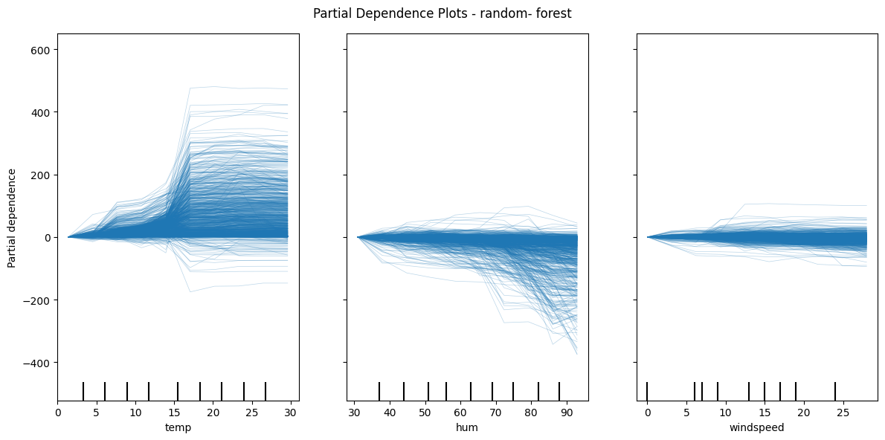

Dans la grande majorité des cas les courbes ont la même allure et donc l'effet semble similaire chez nos individus. Le PDP peut donc être un bon résumé des relations entre nos features et la variable à prédire.

**Avantages :**

- Contraitement aux PDP les ICE peuvent révéler des intéractions hétérogènes dans nos variables.

**Désavantages:**

- Les courbes ICE ne peuvent afficher qu'une seule feature à la fois. Il serait trop compliqué de lire une superposition de surfaces comme dans l'exemple 2D de PDP pour des prédictions individuelles.
- La **corrélation** reste encore un problème ici. Si on fixe les autres variables à leur valeur, cela peut produire des combinaisons irréalistes.
- Le Graphique peut vite être surchargé si on ajuste pas le nombre de lignes ou la transparence.

### Local surogate (Lime)

L'algorithme LIME( Local interpretable model-explanation )  est une méthode d'explicabilité conçue pour interpréter des modèles black box.

L'idée est d'expliquer **localement** la prédiction d'un modèle en utilisant un modèle **plus simple** et compréhensible dans un voisinage spécifique de l'exemple à expliquer (Reg linéaire, arbre, Lasso, ...)

Prenons l'exemple d'un modèle Black Box très complexe, vous possédez les caractéristiques d'un unique individu. Votre objectif est de comprendre pourquoi le modèle de machine learning prédit une valeur pour cet individu.

Pour cela vous allez générer un dataset à partir de cette observation et dupliquer cette observation en introduisant de léger changement dans les données.

Ces perturbations vous permettront de comprendre pour chaque feature l'apport dans la prédiction. Les perturbations du dataset peuvent représenter une variation plus ou moins importante des caractéristiques de nos individus.

L'ordre de grandeur de ces variations sont importantes pour estimer suite à une variation l'impact sur la variable $y$.

Afin de comprendre les effets de toutes ces variations, nous utilisons un modèle linéaire avec ce dataset perturbé et les valeurs prédites comme étant le nouveau $y$.

Ce modèle nous permettra de comprendre pour un individu l'effet des variables sur sa prédiction.

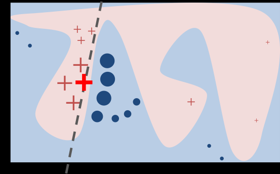

> Frontière de décision d'un modèle complexe, interprété localement par une régression linéaire pour une prédiction

#### Théorie :

---

1. Modèle à expliquer $\hat{f(x)}$ : Le classifieur ou modèle de régression.
2. Nombre d'échantillons (N) : Nombre de points à générer qui seront perturbés pour créer l'explication
3. Instance cible (x) : L'instance à expliquer, ainsi que sa version interprétable (**x'**).
4. **Noyau de similarité $π_x$** : Une fonction mesurant la proximité entre les échantillons générés et l'instance cible.
5. **Nombre de feature explicatives (K)** : Le nombre maximal de caractéristiques utilisées dans l'explication.

---

#### Étapes de l'algorithme :

1. **Initialisation** :

   - Créez un ensemble vide $Z$ pour stocker les données générées.
2. **Génération d'échantillons** :

   - Répétez **N** fois :
     - Générer un échantillon interprétable (**z'**) autour de **x'**.
     - Associer à **z** :
       - La prédiction du modèle **f(z)**.
       - La similarité entre **z** et **x**, notée **πx(z)**.
       - Pondération, plus similarité entre **z** et **x** plus **x'** sera pondéré.
     - Ajouter ces informations à l'ensemble `Z`.
3. **Apprentissage d'un modèle local** :

   - Utilisez une régression Lasso avec régularisation (**K-Lasso**) pour sélectionner au plus **K** caractéristiques dans **Z**.
   - Les caractéristiques sélectionnées et leurs poids forment l'explication locale.

---

#### Exemple et implémentation :

```python
import lime
import lime.lime_tabular

#Création de l'explainer
explainer = lime.lime_tabular.LimeTabularExplainer(X_train.to_numpy(),  # Attention au format numpy array obligatoire
                                                   feature_names=features_names , #Nom des features du modèle
                                                   class_names=['cnt']  , #Variable à predire
                                                   verbose=True,
                                                     mode='regression' # Classification ou régression
                                                     )
# Index de l'individu à prédire
i = 3018
# Résultat de l'explainer
exp = explainer.explain_instance(X_train.loc[i], rf.predict, num_features=5)
```

Une fois réalisé vous obtenez un explainer par individu qui sera le résultat d'un modèle local. Ce modèle vous fournira sa valeur prédite vs la valeur réelle issue du modèle black-box.

💡Notez également que LIME fournit une interprétation qualitative, chaque variable est discrétisée pour faciliter l'interprétation, selon les auteurs du papier de recherche :

- Les variables continues centrées sont trop compliquées à interpréter
- Le double effet négatif engendre également une difficulté de compréhension

Chaque variable continue est alors discrétisée à l'aide de ses quantiles.

```pyth
#Afficher lime explainer in notebook
exp.show_in_notebook(show_table=True)
```

**Exemple de sortie de Lime :**

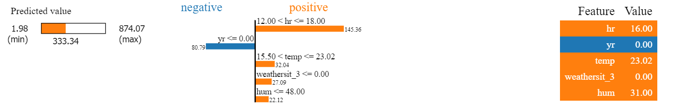

**A gauche**, on peut lire la valeur prédite par notre modèle local ( LIME stock également la valeur prédite par le modèle black box).

**Au centre**, on peut lire l'effet des variables discrétisées sur la prédiction.

**A droite**, la valeur de chaque feature avant la discrétisation.

**Avantages :**

- Interprétation facile car elle vous permet de mobiliser vos connaissances des modèles linéaires
- Possibilité de réduire le nombre de variables explicatives en utilisant la méthode du Lasso
- Fonctionne avec les données tabulaires, textes et images!

**Désavantages :**

- Il peut relativement être compliqué de créer des instances similaires surtout pour les données tabulaires

### Shapley Values :

Cette partie sera consacrée aux valeurs de shapley issues de la théorie des jeux à leur utilisation dans l'interprétation des modèles black box avec les shapleys additive exPlanations AKA SHAP.

Exemple intuitif : Qui paiera le taxi?

Supposons un jeu de coopératif où nous avons 3 joueurs et nous voulons savoir comment répartir le prix d'un taxi en fonction de leurs caractéristiques.

Nos 3 joueurs Alice, Bob & Charlie forment une coalition et recoivent un montant spécifique lors du paiement du taxi ( ici le paiement est négatif).

L'objectif est de déterminer pour chaque joueur un prix équitable du taxi. Nous posons alors aux joueurs et ce de façon aléatoire le prix qu'ils sont prêts  à payer en fonction d'avec qui ils seront dans le taxi.

- Alice seule payera 15€
- Alice et Bob vivent ensemble mais Bob veut toujours prendre une voiture haut de gamme donc ce sera 25€ (15 € pour Alice et 10€ de majoration pour le standing)
- Charlie, Alice et Bob paieront 51€ de taxi car Charlie habite très loin.

Voici l'ensemble des combinaisons possibles :

| Passengers            | Cost | Note                                               |
| --------------------- | ---- | -------------------------------------------------- |
| ∅                    | €0  | Pas de taxi                                        |
| {Alice}               | €15 | Alice seul                                         |
| {Bob}                 | €25 | Bob seul car il aime le luxe                       |
| {Charlie}             | €38 | Charlie seul et qui habite loin                    |
| {Alice, Bob}          | €25 | Bob veut toujours le luxe                          |
| {Alice, Charlie}      | €41 | On dépose Alice en premier, ensuite Charlie       |
| {Bob, Charlie}        | €51 | Déposer le luxeux Bob en premier, après Charlie |
| {Alice, Bob, Charlie} | €51 | Les 3 prennent le taxi                             |

∅ est l'ensemble vide, personne ne prend le taxi.

Ce tableau permet de donner une vague idée de combien chaque passager contribue à une course en taxi. Mais il représente le coût à payer pour une coalition.

#### Calcul de la contribution marginal de chaque passager

La contribution marginale d'un joueur est le montant qu'un individu ajoute au coût total lorsqu'il rejoint un groupe déja formé.

- Si Alice monte seule dans le taxi, elle paie l'intégralité du coût
- Si Alice rejoint le taxi avec Bob, elle paie uniquement le surcoût qu'elle apporte en plus de la présence de Bob

Si on compare la coalition {Alice, Bob} avec la coalition {Bob} seul, on peut en dériver la valeur marginale de Alice à la coalition {Bob}.

Cela donne 25 Bob seul et 25 Bob et Alice soit 0€. Le coût marginal de Alice est de 0 dans cette coalition.

A l'inverse le cout marginal de Bob avec la coalition Alice on obtient 25 - 15 = 10€. Cela veut dire que Bob paie 10 dollars le prix.

On calcule donc tous les coûts marginaux possibles pour chaque coalition :

| Ajout           | Coalition existante | Coût avant | Coût aprpès | Contribution marginale |
| --------------- | ------------------- | ----------- | ------------- | ---------------------- |
| Alice ∅        | ∅                  | 0           | 15            | 15€                   |
| Alice           | {Bob}               | 25          | 25            | 0€                    |
| Alice           | {Charlie}           | 38          | 41            | 3€                    |
| Alice           | {Bob, Charlie}      | 51          | 51            | 0€                    |
| Bob ∅          | ∅                  | 0           | 25            | 25€                   |
| Bob             | {Alice}             | 15          | 25            | 10€                   |
| Bob             | {Charlie}           | 38          | 51            | 13€                   |
| Bob             | {Alice, Charlie}    | 41          | 51            | 10€                   |
| Charlie ∅      | ∅                  | 0           | 38            | 38€                   |
| Charlie {Alice} | {Alice}             | 15          | 41            | 26€                   |
| Charlie         | {Bob}               | 25          | 51            | 26€                   |
| Charlie         | {Alice, Bob}        | 25          | 51            | 26€                   |

Nous avons les coûts marginaux de chaque coalition, il reste maintenant à calculer la contribution marginale de chaque passager.

On pourrait assigner une pondération équitable à chaque contribution marginale et moyénniser mais la meilleur façon de le faire est de considérer toutes les permutations possibles et pondérer la moyenne en fonction de ces permutations.

- Alice, Bob, Charlie
- Alice, Charlie, Bob
- Bob, Alice, Charlie
- Charlie, Alice, Bob
- Bob, Charlie, Alice
- Charlie, Bob, Alice

Mathématiquement cela correspond à 3! = 3 * *2* * 1 permutations possibles

#### Moyenniser la contribution marginale

Dans 2 cas Alice est ajoutée à un taxi vide, dans un cas elle est rajoutée ave Bob, ...

En pondérant les contributs marginal on obtient le calcul suivant pour la contribution moyenne :

$\frac{1}{6} ( \underbrace{2* 15€ }_\textrm{Alice to ∅ } + \underbrace{1* 0€ }_\textrm{Alice to Bob  } + \underbrace{1* 3€ }_\textrm{Alice to Charlie  } + \underbrace{2* 0€ }_\textrm{Alice to Bob,Charlie  } ) = 5.5€$

Pour Bob :

$\frac{1}{6} ( \underbrace{2* 25€ }_\textrm{Bob to ∅ } + \underbrace{1* 10€ }_\textrm{Bob to Alice  } + \underbrace{1* 13€ }_\textrm{Bob to Charlie  } + \underbrace{2* 10€ }_\textrm{Bob to Alice,Charlie  } ) = 15.5€$

Pour Charlie :

$\frac{1}{6} ( \underbrace{2* 38€ }_\textrm{Charlie to ∅ } + \underbrace{1* 26€ }_\textrm{Charlie to Bob  } + \underbrace{1* 26€ }_\textrm{Charlie to Alice  } + \underbrace{2* 26€ }_\textrm{Charlie to Alice,Bob  } ) = 30€$

La contribution individuelle de chacun nous donne bien 5.5 + 15.5 + 30 = 51€.

La Shapley value est donc : La valeur moyenne pondérée de la contribution marginale des joueurs.

#### Des valeurs de Shapley à son usage pour le machine learning

Prenons l'exemple de machine learning suivant :

Une personne souhaite prédire le prix d'un appartement en fonction de sa proximité à un parc, de la taille de l'appartement, son étage et la possibilité d'y avoir un chat.

La prédiction moyenne pour le prix d'un appartement dans cette ville est de 310 000€

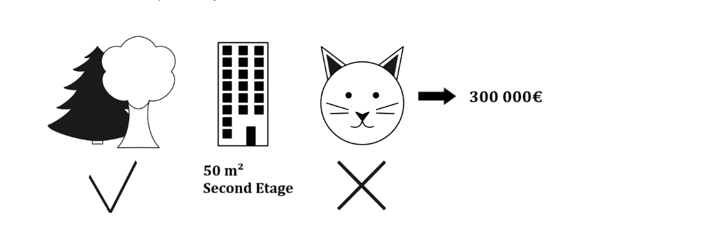

C'est un cas d'usage classique en apprentissage supervisé mais quel est le lien avec notre théorie des jeux? Où est le gain , les joueurs et la coalition? Ici :

- Le gain  = E(f(x) - Prédiction du modèle ==> 310 000 - 300 000
- Les joueurs sont les features utilisées qui collaborent pour réaliser une prédiction
- La coalition, l'ensemble des features activées pour prédire le résultat

Pour calculer les shapley value sur des features il faut procéder de la manière suivante :

On suppose qu'on souhaite étudier la feature `chat interdit` quand il est ajouté à la coalition `parc-proche & 50m²`. Problème pour étudier cette coalition on oublie la variable indiquant `L'étage` .

Quand on étudie une coalition comme {parc-proche, 50m²} et l'ajout de {chat interdit} on suppose que toutes les autres features deviennent des variables aléatoires.

Exemple :

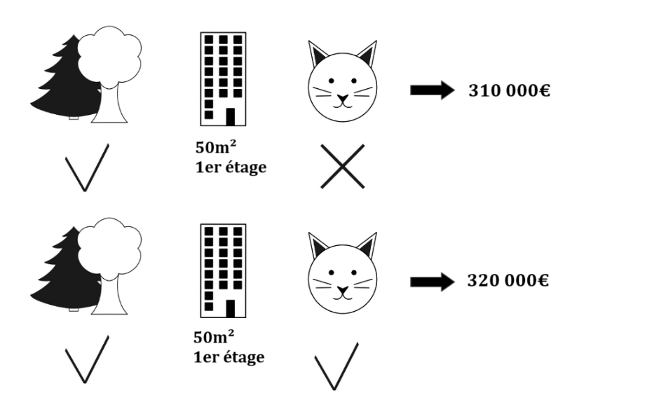

Pour calculer la valeur de shapley il nous faut l'ensemble des coalitions possibles et l'ajout de l'effet de l'ajout de la variable chat pour chacun.

* ∅
* `parc-proche`
* `50m²`
* `2nd etage`
* `parc-proche`+`50m²`
* `parc-proche`+`2nd étage`
* `50m²`+`2nd étage`
* `parc-proche`+`50 m²`+`2nd étage`.

⚠️ On observe que plus nous avons de feature d'intéret pour le temps de calcul sera long pour le calcul de shapley value.

#### Formalisation

**Objectif :**

Calculer la valeur de Shapley pour la valeur de la \( j \)-ème caractéristique.

#### **Entrées requises :**

- \( M \) : Nombre d'itérations.
- \( x \) : Instance d'intérêt.
- \( j \) : Indice de la feature.
- \( X \) : Matrice des données.
- \( f \) : Modèle de machine learning utilisé pour les prédictions.

---

**Étapes de l'algorithme :**

1. **Pour chaque itération $( m = 1, \dots, M )$ :**

   - Tirer une instance aléatoire $( z )$ de la matrice des données $( X )$.
     - Choisir une permutation aléatoire $( o )$ des indices des caractéristiques.
     - Réordonner l'instance $( x )$ selon cette permutation :
       $x_o = (x_{(1)}, \dots, x_{(j)}, \dots, x_{(p)})$
     - Réordonner également l'instance \( z \) selon cette permutation :
       $z_o = (z_{(1)}, \dots, z_{(j)}, \dots, z_{(p)})$

   **Construire deux nouvelles instances :**

   - Instance **avec $( j )$** :
     $x_+j = (x_{(1)}, \dots, x_{(j-1)}, x_{(j)}, z_{(j+1)}, \dots, z_{(p)})$

     Ici on conserve les caractéristiques de j et on intègre les valeur aléatoires des features non étudiés $z$
   - Instance **sans \( j \)** :
     $x_j = (x_{(1)}, \dots, x_{(j-1)}, z_{(j)}, z_{(j+1)}, \dots, z_{(p)})$

     Ici on retire les caractéristiques de j remplacée par une permutation aléatoire de $z_{j}$

**Calculer la contribution marginale :**
	 	  $	\phi^m_j = f(x_+j) - f(x_-j)$

---

**Accumuler la contribution marginale sur toutes les itérations.**

---

#### **Calcul final :**

Une fois toutes les itérations effectuées, la valeur de Shapley pour la caractéristique \( j \) est donnée par la moyenne des contributions marginales :
$\phi_j(x) = \frac{1}{M} \sum_{m=1}^M \phi^m_j$

---

En résumé : Les shapley value mises en pratiquent sont simplement la mesure de l'effet de la désactivation de la variable $(X_j)$ dans la prédiction de l'individu $n°i$.

#### Exemple et implémentation

L'implémentation se fera avec la librairie python [shap](https://shap.readthedocs.io/en/stable/index.html). Celle-ci possède 3 niveaux d'analyses :

- Explicabilité d'une prédiction à travers ses graphiques Watterfall Plot et Force Plot
- Interprétabilité globale avec la somme des explicabilités individuelles : Beeswarm Plot
- Effet d'une feature : Interaction/Scatter plot

##### Explicabilité

Continuons notre exemple avec notre Random Forest.

```python
# Importer la librairie Shap
import shap 

# Définir le module explainer de Shap, attention ce n'est pas le même si c'est un modèle basé sur des abres

explainer = shap.TreeExplainer(rf)

# On calcule les shap values, attention c'est très couteux en temps de calcul.
# On prend donc un échantillon

shap_values = explainer(X_train.iloc[1:100])
```

Une fois les valeurs shap calculées on peut passer à la création d'un graphique.

Pour un individu on peut lancer le force plot.

```python
shap.initjs()
# visualize the first prediction's explanation
shap.waterfall_plot(shap_values[86])
```

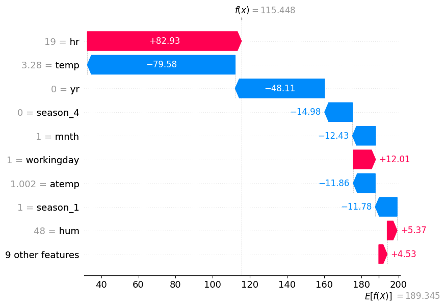

L'interprétation se fait de la manière suivante :

- L'axe des Y montre les effets individuelles de chaque feature avec la valeur de l'instance
- Les features sont ordonnées par ordre d'importance
- L'axe des X nous donne la valeur de la shapley value
- Chaque bar représente la valeur de shapley pour la valeur de l'instance
- On voit sur l'axe des X $E[f(X)]$ qui est la valeur moyenne de notre target
- $f(x)$ est la valeur de la prédiction pour l'instance $x_i$
- La couleur bleu indique une contribution négative de la feature et en rouge une contribution positive par rapport à la target

> Interpretation : La valeur prédite de 115.48 vélos loués pour l'instance 98 différe de la moyenne de 74 vélos.
>
> La variable heure qui est égale à 19 heures ici contribue à augmenter de 83 vélos notre prédiction
>
> Quant-à-elle la variable température à 3.28 °c diminue de 8. vélo la prédiction.

Une autre représentation de ce graphique applatie de ce graphique est le force_plot.

```python
shap.force_plot(shap_values[86])
```

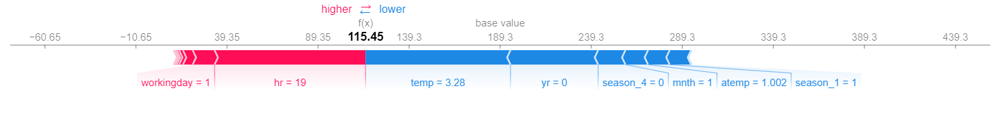

La lecture se fait de la même manière mais elle permet de distinguer plus facilement les features jouant un rôle positif et celles jouant un rôle négative.

##### Interprétabilité

Après avoir calculé les valeurs de shapley pour les instances on cherche maintenant à avoir une vision d'ensemble du modèle. Une interprétation globale de notre modèle.

Heuresement Shap nous offre cette possibilité en calculant les valeurs pour un ensemble de point( idéalement tout le dataset). Le passage à l'interprétation globale se fait en **moyennisant les résultats individuels.**

```python
#Graphique beeswarm, interprétabilité globale 
shap.plots.beeswarm(shap_values)
```

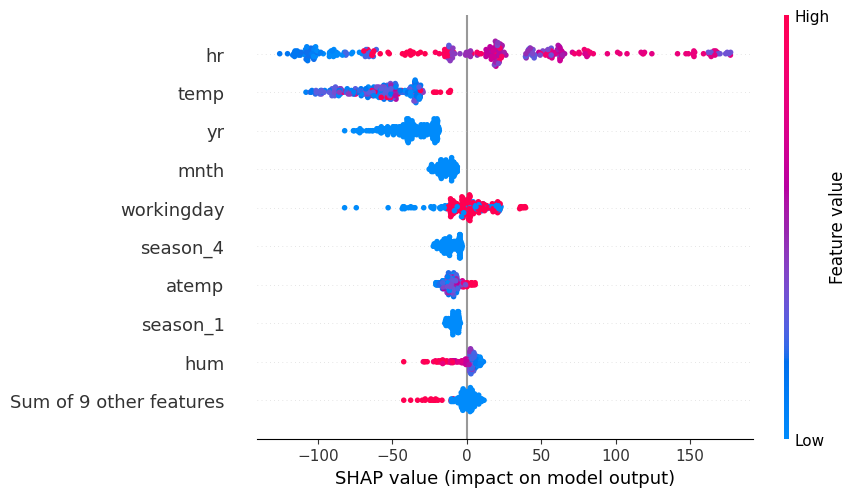

L'interprétation se fait de la manière suivante :

- L'axe des X représente la valeur de Shapley
- L'axe des Y représente les features et en couleur la valeur des features (rouge valeur élevées, bleu valeur faible)
- Chaque ligne correspond à une feature avec la distribution de valeur de shapley associée à chaque instance
- L'ordre des features est données par la valeur moyenne de Shapley des instances

La distribution de la couleur révèle également la nature de la relation entre la feature et nos données. Pour la variable ` hr` des valeurs hautes et faibles s'entremèle ce qui signifie que la relation n'est pas monotone.

De la même manière on peut lire qu'une humidié avec de forte valeur impact la shapley value de facon négative à l'inverse une humidité faible offre une shapley value légèrement positive.

💡De manière génréral voici les clés pour l'interprétation :

1. Observer l'ordre des features, plus une feature est haute plus elle aura une influence sur la shapley value
2. Pour chaque feature d'intéret regarder
   1. Sa distribution et voir son influence. Plus la distribution sera large plus la variable aura une influence.
   2. Regarder la distribution des couleurs et voir s'il y a une relation monotone ou un pattern plus complexe

##### Effet d'une variable sur notre target

Shap offre un équivalent au Partial Depence Plot appelé scatter. Il permet d'étudier la relation entre les valeurs de shapley et la distribution de la feature.

Cela nous permet de connaitre la relation entre notre variable d'intérêt(la vente de vélo) et une unique variable.

```python
shap.plots.scatter(shap_values[:, 'hr'])
```

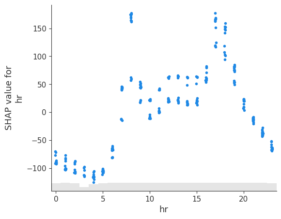

Interprétation :

- L'axe des X représente la distrubution de la variable Hr
- L'axe des Y représente la valeur de Shapley
- C'est une projection du beeswarm pour une unique feature
- L'histogramme en gris indique la distribution de notre feature Hr

### Comment interpreter les shapley values après la standardization

Une transformation usuel d'un jeu de données afin de l'utiliser dans un modèle de machine learning est de standardiser les données.

Cela améliore généralement les performances des modèles et permet de comparer nos variables exprimées dans un même ordre de grandeur mais celui nuit grandement à l'interprétation individuelle des variables.

On cherchera bien souvent à se ramener aux valeurs d'origines pour l'interprétation.

Pour cela on s'appuyera sur la propriété suivante des valeurs de Shapley :

> Si une transformation **univariée** (c’est-à-dire appliquée indépendamment à chaque caractéristique) est utilisée, comme la standardisation,  **les valeurs de Shapley restent inchangées** . Cela signifie qu'il est possible de calculer les SHAP values directement pour les caractéristiques standardisées, puis de les interpréter en les ramenant à leurs valeurs d'origine.

Prenons le dataset suivant

```python
import shap
from sklearn.model_selection import train_test_split
X, y = shap.datasets.adult()
X_train, X_test, y_train, y_test = train_test_split(
X, y, test_size=0.2, random_state=1
)

print(X.head(2))

```

|   | Age  | Workclass | Education-Num | Marital Status | Occupation | Relationship | Race | Sex | Capital Gain | Capital Loss | Hours per week | Country |
| - | ---- | --------- | ------------- | -------------- | ---------- | ------------ | ---- | --- | ------------ | ------------ | -------------- | ------- |
| 0 | 39.0 | 7         | 13.0          | 4              | 1          | 0            | 4    | 1   | 2174.0       | 0.0          | 40.0           | 39      |
| 1 | 50.0 | 6         | 13.0          | 2              | 4          | 4            | 4    | 1   | 0.0          | 0.0          | 13.0           | 39      |

Entrainons une régression logistique pour modéliser les personnes gagnants plus de 50 000$ par mois.

```python
# get standardized data
scaler = StandardScaler()
scaler.fit(X_train)
X_std = scaler.transform(X)

# train the linear model
lr = LogisticRegression()
model = lr.fit(X_std, y)

# explain the model's predictions using SHAP
explainer = shap.explainers.Linear(model, X_std)
shap_values = explainer(X_std)

# visualize the model's dependence on the first feature
shap.plots.scatter(shap_values[:,0])

```

Effet de la feature N°0 sur les shapley value ( ici c'est l'âge standardisée)

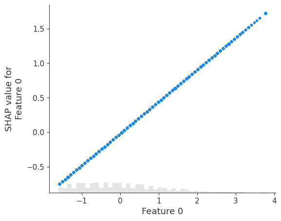

L'interprétation est relativement compliquée avec des variables standardisée.

Ici 0.8 veut dire que l'âge d'un individu est 0.8 écart type au dessus de la moyenne.

```python
# On rajoute les noms des features dans les valeurs de shapley
for i, c in enumerate(X.columns):
    shap_values.feature_names[i] = c


# On remplace les valeurs de X_std par ses valeurs orginales.
## Car la transformation de standscaler est univariée!

shap_values.data = X.values

# visualize the model's dependence on the first feature again, now in the new original feature space
shap.plots.scatter(shap_values[:, 0])

```

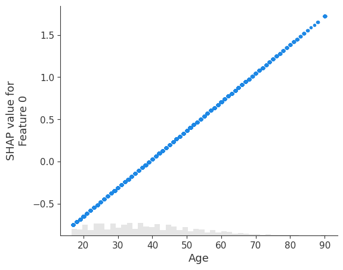

#### Une manière plus élégante de le faire est d'utiliser les pipelines de sklearn

```python
from sklearn.compose import ColumnTransformer
from sklearn.pipeline import Pipeline
from sklearn.preprocessing import OneHotEncoder, StandardScaler
from sklearn.linear_model import LogisticRegression
import numpy as np

# Define the categorical and numerical features
cats = ['Workclass', 'Marital Status', 'Occupation',
'Relationship', 'Race', 'Sex', 'Country']

nums = ['Age', 'Education-Num', 'Capital Gain',
'Capital Loss', 'Hours per week']

# Define the column transformer
preprocessor = ColumnTransformer(
transformers=[
('cat', OneHotEncoder(), cats),
('num', StandardScaler(), nums)
])

# Define the pipeline
model = Pipeline([
('preprocessor', preprocessor),
('classifier', LogisticRegression(max_iter=10000))
])

import shap
from sklearn.model_selection import train_test_split
X, y = shap.datasets.adult()
X_train, X_test, y_train, y_test = train_test_split(
X, y, test_size=0.2, random_state=1
)

# Fit the pipeline to the training data
model.fit(X_train, y_train)
X_sub = shap.sample(X_train, 100)
ex = shap.Explainer(model.predict_proba, X_sub)
shap_values = ex(X_test.iloc[0:100])


shap.plots.scatter(shap_values[:,0,1])
```

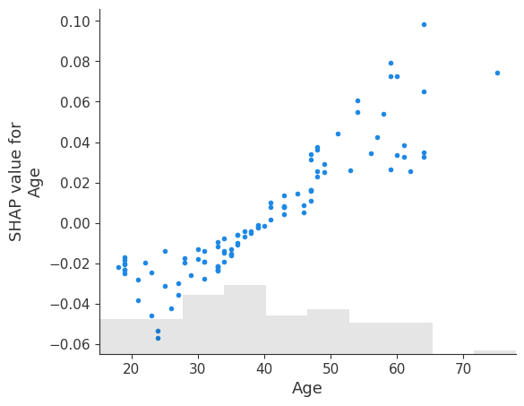

#### Shapley value et corrélation

Les shapley value sont également sensibles aux corrélations de vos features!!

En effet, à l'instar des Partial Depence Plot on "fixe" des variables tout en faisant varier la valeur des autres ce qui peut conduire à des combinaisons irréalistes.

Ces combinaisons apparaissent lorsque des features sont corrélées, les solutions qui s'offrent à vous pour réduire ce problème sont les suivantes :

- Méthode de feature selection qui élimine les features corrélées
- Eliminer les features avec peu de variance
- Technique de réduction de dimension comme l'ACP (⚠️ attention cela complique l'interprétabilité)
- Transformation de vos features pour casser le line linéaire (mise au carré, log, sqrt, ...)
- Combiner des features corréles
